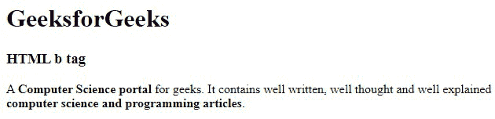

# HTML b 标签

> 原文:[https://www.geeksforgeeks.org/html-b-tag/](https://www.geeksforgeeks.org/html-b-tag/)

**示例:**这个简单的代码示例说明了通过在 HTML 中将文本设为粗体文本来突出显示文本。

## 超文本标记语言

```html
<!DOCTYPE html>
<html>
<body>
    <h1>GeeksforGeeks</h1>
    <h3>HTML b tag</h3>
    <p>
      A <b>Computer Science portal</b> for geeks. 
      It contains well written, well thought and
      well explained <b>computer science and 
      programming articles.</b>
    </p>

</body>
</html>
```

**输出:**



HTML 中的**标记用于指定粗体文本，没有任何额外的重要性。文本以粗体显示在**标签内。您可以使用*字体粗细:粗体；*CSS 中的属性。它是一个容器标签，包含一个开始标签，内容&结束标签。还有一个类似的标签， [<强>](https://www.geeksforgeeks.org/html-strong-tag/#:~:text=The%20tag%20in%20HTML,Make%20that%20text%20bold.) 标签就是解析后的标签，用来表示文本的重要性&对内容有类似的效果。****

根据 HTML5 规范，**标签应该作为最后的选择，在没有其他标签更合适的时候使用。HTML5 规范规定，对于标题，应该用 [< h1 >到< h6 >](https://www.geeksforgeeks.org/html-heading/) 标签来描述，对于强调的文字，必须用 [< em >](https://www.geeksforgeeks.org/html-em-tag/) 标签&来描述。同理，重要的文字应该用 [<强>](https://www.geeksforgeeks.org/html-strong-tag/#:~:text=The%20tag%20in%20HTML,Make%20that%20text%20bold.) 标签来描述，&对于标记/高亮的文字，应该用 [<标记>](https://www.geeksforgeeks.org/html-mark-tag/#:~:text=The%20tag%20in%20HTML,the%20text%20in%20a%20paragraph.&text=Example%201%3A%20This%20example%20uses,text%20content%20in%20yellow%20color.) 标签来表示。**

**语法:**

```html
<b> Contents... </b>
```

**接受属性** **:** 这是一个[全局属性](https://www.geeksforgeeks.org/html-global-attributes/)，可以用在任何 HTML 元素上。

**示例 1:** 在本例中，我们使用了< b >标签& < p >标签来说明文本外观&的大小差异。

## 超文本标记语言

```html
<!DOCTYPE html>
<html>
<body>
    <h1>GeeksforGeeks</h1>
      <h3>HTML b tag</h3>

    <!--paragraph Tag -->
    <p>This is normal paragraph Tag text</p>

    <!--bold Tag -->
    <b>This is bold Tag text</b>
</body>
</html>
```

**输出:**


**示例 2:** 在本例中，我们使用了 [CSS 字体粗细属性](https://www.geeksforgeeks.org/css-font-weight-property/)，其值被设置为粗体以使文本加粗。

## 超文本标记语言

```html
<!DOCTYPE html>
<html>
<body>
    <h1>GeeksforGeeks</h1>
      <h3>HTML b tag</h3>

    <!--paragraph Tag -->
    <p>This is normal paragraph Tag text</p>

    <!--Using CSS in paragraph Tag for making text bold  -->
    <p style ="font-weight: bold">This is bold text using CSS</p>

</body>
</html>
```

**输出:**


**支持的浏览器:**

*   谷歌 Chrome 93.0
*   Internet Explorer 11.0
*   微软边缘 93.0
*   Firefox 92.0
*   Opera 78.0
*   Safari 14.1