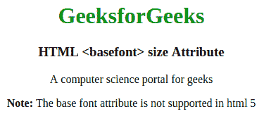

# HTML | <basefont>大小属性

> 原文:[https://www.geeksforgeeks.org/html-basefont-size-attribute/](https://www.geeksforgeeks.org/html-basefont-size-attribute/)

**HTML <基本字体>大小属性**用于指定文档的默认字体大小。**<basfront>**tag**face**和 **color** 还有两个属性指定了文本的**颜色**和文本的**字体系列**。HTML 5 不支持 **< basfront >** 标签。

**语法:**

```html
<basefont size="number"> 
```

**属性值:**包含单值**号**，指定文本文档的字体大小。它的默认值是 3。

**示例:**

```html
<!DOCTYPE html>
<html>

<head>
    <title>
        HTML basefont size Attribute
    </title>

    <basefont color="red" size="15" 
            face="courier, serif">

    <style>
        body {
            text-align: center;
        }
        h1 {
            font-weight: bold;
            color: green;
        }
        h3 {
            font-weight: bold;
        }
    </style>
</head>

<body>
    <h1>GeeksforGeeks</h1>
    <h3>HTML <basefont> size Attribute </h3>

    <p>A computer science portal for geeks</p>

    <p>
        <b>Note:</b> The basefont attribute
        is not supported in html 5
    </p>
</body>

</html>
```

**输出:**


**支持的浏览器:**任何浏览器都不支持 *HTML <基本字体> >大小属性*。