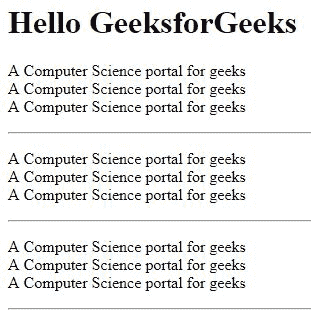

# HTML 基础知识

> 原文:[https://www.geeksforgeeks.org/html-basics/](https://www.geeksforgeeks.org/html-basics/)

在本文中，我们将浏览 HTML 编码的所有基本内容。在开始用 HTML 编码时，我们必须考虑并包含各种标签。这些标签有助于脚本或网页中元素的组织和基本格式。这些循序渐进的步骤将指导你完成编写 HTML 的过程。

**基本 HTML 文档:**下面提到的是将整个文档划分为头部、身体等各个部分的基本 HTML 标签。

*   每个 HTML 文档都以一个 HTML 文档标签开始。虽然这不是强制性的，但用下面提到的标签开始文档是一个很好的习惯。有关文档类型的更多信息，请参考 [HTML 文档类型](https://www.geeksforgeeks.org/html-doctypes/)一文。

```html
<!DOCTYPE html>
```

*   [**< html >**](https://www.geeksforgeeks.org/html-html-tag/) :每一个 html 代码都必须括在基本的 HTML 标签之间。它以 **< html >** 开头，以 **< /html >** 标签结尾。
*   [**<head>**](https://www.geeksforgeeks.org/html-head-tag/):head 标签紧随其后，包含网页或文档的所有标题信息，如页面标题和其他杂项信息。该信息包含在以 **<【头部】>** 开头，以**</头部>** 结尾的头部标签中。这个标签的内容将在后面的章节中解释。
*   [**<标题>**](https://www.geeksforgeeks.org/html-title-tag/) **:** 我们可以使用 **<标题>** 标签来提及网页的标题。这是标题信息，因此在标题标签中提到。标签以 **<标题>** 开头，以**</标题>结尾。**
*   [**<车身>**](https://www.geeksforgeeks.org/html-body-tag/) **:** 下一步是我们目前所学的所有标签中最重要的。body 标签包含页面的实际主体，所有用户都可以看到。以 **<车身>** 开始，以**</车身>** 结束。这个标签中包含的每一个内容都将显示在网页上，无论是文字、图像、音频、视频，甚至是链接。我们将在本节后面看到如何使用各种标签将提到的内容插入到我们的网页中。

代码的整个模式看起来像下面的代码示例。

**示例:**这个示例说明了 HTML 代码的基本结构。

## 超文本标记语言

```html
<html>

<head>
    <!-- Information about the page -->
    <!--This is the comment tag-->

    <title>GeeksforGeeks</title>
</head>

<body>
    <!--Contents of the webpage-->
</body>

</html>
```

这段代码不会显示任何内容。它只是展示了如何编写 HTML 代码的基本模式，并将页面标题命名为 *GeeksforGeeks* 。<！––此处的注释–>是 HTML 中的注释标签，它不读取该标签中的行。

[**HTML 标题**](https://www.geeksforgeeks.org/html-heading/) **:** 这些标签帮助我们给网页的内容赋予标题。这些标签主要写在正文标签里面。HTML 为我们提供了从 **< h1 >** 到 **< h6 >** 的六个标题标签。每个标签都以不同的样式和字体大小显示标题。

**示例**:这个示例说明了从 **< h1 >** 到 **< h6 >** 的 6 个标题标签在 HTML 中的使用。

## 超文本标记语言

```html
<html>

<head>
    <title>GeeksforGeeks</title>
</head>

<body>
    <h1>Hello GeeksforGeeks</h1>
    <h2>Hello GeeksforGeeks</h2>
    <h3>Hello GeeksforGeeks</h3>
    <h4>Hello GeeksforGeeks</h4>
    <h5>Hello GeeksforGeeks</h5>
    <h6>Hello GeeksforGeeks</h6>
</body>

</html>
```

**输出**:


[**HTML 段落**](https://www.geeksforgeeks.org/html-paragraph/) **:** 这些标签帮助我们在网页上写段落语句。它们以 **< p >** 标记开始，以 **< /p >** 结束。这里 **< br >** 标记用来断线，充当回车。 **< br >** 是一个空标签。

**示例**:这个示例说明了使用< p >标签在 HTML 中编写段落语句。

## 超文本标记语言

```html
<html>

<head>
    <title>GeeksforGeeks</title>
</head>

<body>
    <h1>Hello GeeksforGeeks</h1>
    <p> A Computer Science portal for geeks<br>
        A Computer Science portal for geeks<br>
        A Computer Science portal for geeks<br> 
    </p>

</body>

</html>
```

**输出**:


**HTML 水平线:**[<HR>标签](https://www.geeksforgeeks.org/html-hr-tag/)用于将页面分成不同的部分，借助从页面左侧延伸到右侧的水平线创建水平边距。这也是一个空标签，不接受任何附加语句。

**示例**:本示例说明了 HTML 中水平线的< hr >标签的使用。

## 超文本标记语言

```html
<html>

<head>
    <title>GeeksforGeeks</title>
</head>

<body>
    <h1>Hello GeeksforGeeks</h1>
    <p> 
        A Computer Science portal for geeks<br>
        A Computer Science portal for geeks<br>
        A Computer Science portal for geeks<br>
    </p>

    <hr>
    <p> 
        A Computer Science portal for geeks<br>
        A Computer Science portal for geeks<br>
        A Computer Science portal for geeks<br>
    </p>

    <hr>
    <p> 
        A Computer Science portal for geeks<br>
        A Computer Science portal for geeks<br>
        A Computer Science portal for geeks<br>
    </p>

    <hr> 
</body>

</html>
```

**输出**:



[**HTML 图片**](https://www.geeksforgeeks.org/html-images/) **:** 图片标签用于将图片插入我们的网页。要插入的图像的来源放在****标签内。

**示例**:本示例说明了使用< img >标签在 HTML 中插入图像。

## 超文本标记语言

```html
<html>

<head>
    <title>GeeksforGeeks</title>
</head>

<body> 
     
</body>

</html>
```

**输出**:


**支持的浏览器:**

*   谷歌 Chrome 93.0 及以上
*   Internet Explorer 11.0
*   微软边缘 93.0
*   火狐 92.0 及以上版本
*   Opera 79.0
*   Safari 14.1

在 HTML 中还有各种其他的标签来插入链接、音频和各种其他的格式标签，我们将在后面的章节中学习。

本文由 [**【钦莫伊蕾恩卡】**](https://www.linkedin.com/feed/) 供稿。如果你喜欢 GeeksforGeeks 并想投稿，你也可以使用[write.geeksforgeeks.org](https://write.geeksforgeeks.org)写一篇文章或者把你的文章邮寄到 review-team@geeksforgeeks.org。看到你的文章出现在极客博客主页上，帮助其他极客。

如果你发现任何不正确的地方，或者你想分享更多关于上面讨论的话题的信息，请写评论。

HTML 是网页的基础，通过构建网站和网络应用程序用于网页开发。您可以通过以下 [HTML 教程](https://www.geeksforgeeks.org/html-tutorials/)和 [HTML 示例](https://www.geeksforgeeks.org/html-examples/)从头开始学习 HTML。