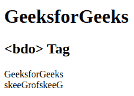

# HTML bdo 标签

> 原文:[https://www.geeksforgeeks.org/html-bdo-tag/](https://www.geeksforgeeks.org/html-bdo-tag/)

<bdo>代表双向超越。此标签用于指定文本方向或用于更改当前方向。</bdo>

**语法:**

```html
<bdo dir> Contents... </bdo>
```

**属性:**该元素包含 dir 属性，用于指定在< bdo >元素内部写入的文本方向。[目录属性](https://www.geeksforgeeks.org/html-dir-attribute/)包含以下两个值:

*   **rtl:** 文字方向从右向左(反转文字)。
*   **ltr:** 文字方向从左到右。

**示例:**以下示例说明了 bdo 标签。

## 超文本标记语言

```html
<!DOCTYPE html>
<html>

<body>
    <h1>GeeksforGeeks</h1>
    <h2><bdo> Tag</h2>
    <!--This is bdo ltr Tag-->
    <bdo dir="ltr">GeeksforGeeks</bdo><br>
    <!--This is bdo rtl Tag-->
    <bdo dir="rtl">GeeksforGeeks</bdo>
</body>

</html>
```

**输出:**



**支持的浏览器:**

*   苹果 Safari
*   谷歌 Chrome
*   火狐浏览器
*   歌剧
*   微软公司出品的 web 浏览器