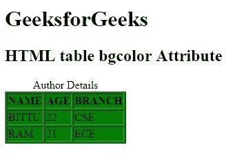
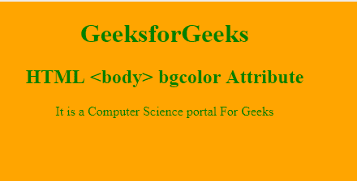

# HTML | bgcolor 属性

> 原文:[https://www.geeksforgeeks.org/html-bgcolor-attribute/](https://www.geeksforgeeks.org/html-bgcolor-attribute/)

**HTML bgcolor 属性**用于设置一个 HTML 元素的背景颜色。Bgcolor 是随着级联样式表的实现而被弃用的属性之一(参见 CSS 背景)。
**语法:**

```html
<"tag" bgcolor="Value">
```

**属性值:**

*   **color_name:** 使用颜色名称设置背景颜色。比如“红色”。
*   **hex_number:** 使用颜色十六进制码设置背景颜色。例如“#0000ff”。
*   **rgb_number:** 用 rgb 码设置背景色。例如:“RGB(0，153，0)”。

**支持的标签:**

*   [车身](https://www.geeksforgeeks.org/html-body-bgcolor-attribute/)
*   [选框](https://www.geeksforgeeks.org/html-marquee-tag/)
*   [表](https://www.geeksforgeeks.org/html-table-bgcolor-attribute/)
*   [证据](https://www.geeksforgeeks.org/html-tbody-tag/)
*   TD
*   tfoot
*   [th](https://www.geeksforgeeks.org/html-th-bgcolor-attribute/)
*   [日期](https://www.geeksforgeeks.org/html-thead-tag/)
*   tr
*   [栏](https://www.geeksforgeeks.org/html-col-bgcolor-attribute/?ref=rp)
*   colgroup

**示例:** HTML <表格> bgcolor 属性

## 超文本标记语言

```html
<!DOCTYPE html>
<html>

<head>
    <title>
        HTML table bgcolor Attribute
    </title>
</head>

<body>
    <h1>GeeksforGeeks</h1>

    <h2>HTML table bgcolor Attribute</h2>

    <table border="1"
        bgcolor="green">
        <caption>
        Author Details
    </caption>

        <tr>
            <th>NAME</th>
            <th>AGE</th>
            <th>BRANCH</th>
        </tr>
        <tr>
            <td>BITTU</td>
            <td>22</td>
            <td>CSE</td>
        </tr>
        <tr>
            <td>RAM</td>
            <td>21</td>
            <td>ECE</td>
        </tr>
    </table>
</body>

</html>
```

**输出:**



**示例:** HTML 正文 Bgcolor 属性

## 超文本标记语言

```html
<!DOCTYPE html>
<html>

<head>
    <title>
    HTML body Bgcolor Attribute
</title>
</head>

<!-- body tag starts here -->

<body text="green" bgcolor="orange">
    <center>
        <h1>GeeksforGeeks</h1>
        <h2>
        HTML <body> bgcolor Attribute
    </h2>

<p>
        It is a Computer
        Science portal For Geeks
    </p>

    </center>
</body>
<!-- body tag ends here -->

</html>
```

**输出:**



**注意:**html 5 不支持 bgcolor 属性。
T3】支持的浏览器:bgcolor 属性支持的浏览器如下:

*   谷歌 Chrome
*   微软公司出品的 web 浏览器
*   火狐浏览器
*   苹果 Safari
*   歌剧