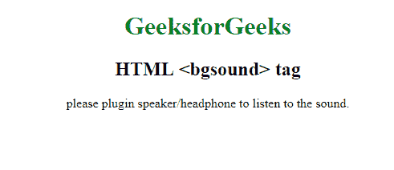

# HTML | bgsound 标签

> 哎哎哎:# t0]https://www . geeksforgeeks . org/html-bgsound 标签/

**HTML < bgsound >标签**是用来在后台播放音轨的，当你离开页面打开一个新的标签后，这个标签会在后台连续播放音轨。
除了 Internet Explorer 之外，此标签不适用于其他浏览器。它不显示任何图形界面，只是在后台播放曲目。

**语法:**

```html
<bgsound src="">
```

**属性:**

*   **src:** 此属性保存将在后台播放的大头钉的路径。
*   **循环:**该属性保存一个数字，表示曲目循环播放的次数。

以下示例说明了 **HTML < bgsound >标记:**
T3】示例:

```html
<!DOCTYPE html>
<html>

<head>
    <title>
      HTML <bgsound> Tag
  </title>
    <style>
        h1 {
            color: green;
        }
    </style>
</head>

<body>
    <center>
        <h1>GeeksforGeeks</h1>
        <h2>HTML <bgsound> tag</h2>
        <bgsound src=
"https://media.geeksforgeeks.org/wp-content/uploads/20190531135120/beep.mp3" />
         <p>please plugin speaker/headphone to listen to the sound.</p>
    </center>
</body>

</html>
```

**输出:**


**支持的浏览器:**以下列出了 **HTML | < bgsound >标签**支持的浏览器:

*   微软公司出品的 web 浏览器