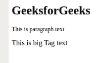
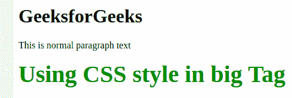

# HTML big 标签

> 原文:[https://www.geeksforgeeks.org/html-big-tag/](https://www.geeksforgeeks.org/html-big-tag/)

HTML 中的<big>标记用于将选定的文本大小增加一个大于周围文本的大小。在 HTML 5 中，它可以被 CSS 使用。</big>

**注意:**HTML 5 不支持

**语法:**

```html
<big> Contents... </big>
```

下面的例子说明了 HTML 中的<big>标签:</big>

**例 1:**

## 超文本标记语言

```html
<!DOCTYPE html>
<html>

<body>
    <h1>GeeksforGeeks</h1>
    <!--Paragraph Tag -->
    <p>This is paragraph text</p>

    <!--Big Tag-->
    <big>This is big Tag text</big>
</body>

</html>
```

**输出:**



**例 2:**

## 超文本标记语言

```html
<!DOCTYPE html>
<html>

<body>
    <h1>GeeksforGeeks</h1>
    <!--Paragraph Tag -->
    <p>This is normal paragraph text</p>

    <!--CSS Style used in big Tag -->
    <big style="font-size:40px; 
                font-weight:bold; 
                color:green; ">
       Using CSS style in big Tag
    </big>
</body>

</html>
```

**输出:**



**支持的浏览器:**

*   谷歌 Chrome
*   微软公司出品的 web 浏览器
*   火狐浏览器
*   歌剧
*   旅行队