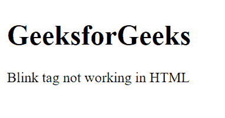

# HTML | blink 标签

> 原文:[https://www.geeksforgeeks.org/html-blink-tag/](https://www.geeksforgeeks.org/html-blink-tag/)

HTML blink 标签用于创建缓慢闪烁的闪烁文本。所有时髦的浏览器都已经过时了，而有些浏览器却一点也不支持它。超文本标记语言也从未对这个标签进行标准化。

您可以使用 CSS 和 JavaScript 重新创建相同的视觉效果。互联网使用指南强烈建议不要使用闪烁的文本，因为这可能会给残疾用户带来问题。闪烁影响很少被使用，因为用户看着文本不停地闪烁是很烦人的。

**例 1:** 本例**无法工作**由于瞬移组件被弃用。为了诱导眨眼的影响，坐下来看用 JavaScript 实现的示例 2。

```html
<!DOCTYPE html>
<html>

<head>
    <title>
        Blinking text using HTML
    </title>
</head>

<body>
    <h1>GeeksforGeeks</h1>

    <blink>
        Blink tag not working
        in HTML
    </blink>
</body>

</html>
```

**输出:**


**示例 b 2:** 本示例使用 JavaScript 创建一个闪烁效果。

```html
<!DOCTYPE html>
<html>

<head>
    <title>
        Blinking with JavaScript
    </title>

    <style>
        #blink {
            font-size: 20px;
            font-weight: bold;
            font-family: sans-serif;
        }
    </style>
</head>

<body>
    <p id="blink">
        Hello Geeks let's Blink
    </p>

    <script type="text/javascript">
        var blink = 
            document.getElementById('blink');

        setInterval(function () {
            blink.style.opacity = 
            (blink.style.opacity == 0 ? 1 : 0);
        }, 1000); 
    </script>
</body>

</html>
```

**输出:**
