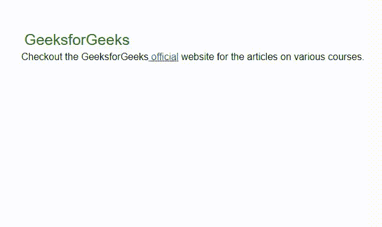
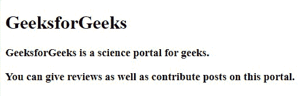
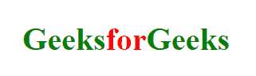

# HTML 块和内嵌元素

> 原文:[https://www . geesforgeks . org/html-block-and-inline-elements/](https://www.geeksforgeeks.org/html-block-and-inline-elements/)

在本文中，我们将了解 **HTML Block 元素& Inline 元素**，并通过示例了解实现。呈现网页内容的每一个超文本标记语言文档都将依赖于元素类型，即块或内嵌，它们是默认显示值。我们将通过例子来理解这两个概念。

**示例:**该示例说明了块级元素&内联元素的使用。

## 超文本标记语言

```html
<!DOCTYPE html>
<html>

<body>
    <div>GeeksforGeeks</div> 
    Checkout the GeeksforGeeks
    <a href="https://www.geeksforgeeks.org/" 
       alt="GeeksforGeeks">
      official</a> website for the articles on various courses. 
</body>

</html>
```

**输出:**



块和内嵌元素

在上面的例子中，我们使用了 [< div >](https://www.geeksforgeeks.org/div-tag-html/) 标签，该标签总是从一个新的行&开始，获取可用的全宽。我们已经使用了内联元素锚标签 [< a >](https://www.geeksforgeeks.org/html-a-tag/) ，用于提供文本链接。内联元素不会在新的一行中开始&只捕获元素周围的空间。

**块级元素:**块级元素总是从新的一行开始，并尽可能向左和向右延伸，即它占据了其父元素&的整个水平空间，高度等于内容的高度。

**支持的标签:**

*   [HTML <地址>标签](https://www.geeksforgeeks.org/html-address-tag/#:~:text=The%20tag%20in%20HTML,contact%20information%20of%20the%20article.)
*   [HTML <区块引用>标签](https://www.geeksforgeeks.org/html-blockquote-tag/#:~:text=The%20tag%20in%20HTML,%2C%20list%2C%20paragraph%2C%20etc.)
*   [HTML < dd >标签](https://www.geeksforgeeks.org/html-dd-tag/#:~:text=The%20tag%20in%20HTML,inside%20a%20tag.)
*   html<div>标记
*   html<dl>标签
*   html<dt>标签
*   [HTML <画布>标签](https://www.geeksforgeeks.org/html-canvas-tag/)
*   [HTML <表单>标签](https://www.geeksforgeeks.org/html-form-tag/)
*   [HTML <标题>标签](https://www.geeksforgeeks.org/html-heading/)
*   html<HR>标签
*   [HTML < li >标签](https://www.geeksforgeeks.org/html-li-tag/#:~:text=The%20tag%20in%20HTML,or%20Unordered%20List%20.&text=Note%3A%20The%20end%20tag%20can,content%20in%20its%20parent%20element.)
*   [HTML <主>标签](https://www.geeksforgeeks.org/html-main-tag/#:~:text=The%20HTML%20Tag%20is,site%20logos%2C%20and%20search%20forms.)
*   [HTML <导航>标签](https://www.geeksforgeeks.org/html-nav-tag/#:~:text=The%20links%20in%20the%20nav,of%20the%20page%20or%20section.)
*   [HTML < noscript >标签](https://www.geeksforgeeks.org/html-noscript-tag/#:~:text=The%20tag%20in%20HTML,%3E%20and%20tag.)
*   [HTML < ol >标签](https://www.geeksforgeeks.org/html-ol-tag/)
*   html<pre>标签
*   [HTML <部分>标签](https://www.geeksforgeeks.org/html-section-tag/)
*   [HTML < tfoot >标签](https://www.geeksforgeeks.org/html-tfoot-tag/)
*   html<ul>标记
*   [HTML 表格](https://www.geeksforgeeks.org/html-tables/)
*   [HTML 段落](https://www.geeksforgeeks.org/html-paragraph/#:~:text=tag%3A%20The%20%3C,this%20may%20raise%20unexpected%20results.)
*   [HTML5 <视频>标签](https://www.geeksforgeeks.org/html5-video/)
*   [HTML5 <一旁>标签](https://www.geeksforgeeks.org/html5-aside-tag/#:~:text=HTML5%20Tag,-Difficulty%20Level%20%3A%20Basic&text=The%20tag%20is%20used,intent%20of%20the%20primary%20page.)
*   [HTML5 <文章>标签](https://www.geeksforgeeks.org/html5-article-tag/)
*   [HTML5 <图片说明>标签](https://www.geeksforgeeks.org/html5-figcaption-tag/#:~:text=The%20tag%20in%20HTML,tag%20is%20new%20in%20HTML5.)
*   [HTML5 <字段集>标签](https://www.geeksforgeeks.org/html5-fieldset-tag/)
*   [HTML5 <图>标签](https://www.geeksforgeeks.org/html5-figure-tag/)
*   [HTML5 <页脚>标签](https://www.geeksforgeeks.org/html5-footer-tag/#:~:text=The%20tag%20in%20HTML,used%20within%20the%20body%20tag.)
*   [HTML 5 <表头>标签](https://www.geeksforgeeks.org/html-5-header-tag/)

**div 元素:**<div>**元素**用作其他 HTML 元素的容器。它没有必需的属性。*风格*、*类*、 *id* 是常用属性。

**语法:**

```html
<div>GFG</div>
```

**示例:**下面的代码说明了< div >标签的实现。

## 超文本标记语言

```html
<!DOCTYPE html>
<html>
<title>Block-level Element</title>

<body>
    <div>
        <h1>GeeksforGeeks</h1>
        <h3>GeeksforGeeks is a science portal for geeks.</h3>
        <h3>
          You can give reviews as well as 
          contribute posts on this portal.
        </h3>
    </div>
</body>

</html>
```

**输出:**



块元素

**内联元素:**内联元素与块级元素相反。它不会从一个新的行开始，只占用必要的宽度 ie。，它只占用定义 HTML 元素的标签所限定的空间，而不会破坏内容的流动。

**支持的标签:**

*   html<br>标记
*   [HTML <按钮>标签](https://www.geeksforgeeks.org/html-button-tag/#:~:text=The%20tag%20in%20HTML,default%20types%20for%20.)
*   [HTML <时间>标签](https://www.geeksforgeeks.org/html-time-tag/)
*   [HTML < tt >标签](https://www.geeksforgeeks.org/html-tt-tag/#:~:text=The%20tag%20is%20the,mainly%20used%20for%20formatting%20purposes.)
*   [HTML <是>标签](https://www.geeksforgeeks.org/html-var-tag/)
*   [HTML <一个>标签](https://www.geeksforgeeks.org/html-a-tag/)
*   [HTML <缩写>标签](https://www.geeksforgeeks.org/html-abbr-tag/#:~:text=The%20tag(Abbreviation,systems%2C%20and%20search%2Dengines.)
*   [HTML <首字母缩略词>标签](https://www.geeksforgeeks.org/html-acronym-tag/#:~:text=The%20tag%20in%20HTML,systems%2C%20and%20search%2Dengines.&text=title%3A%20It%20is%20used%20to%20specify%20extra%20information%20about%20the%20element.)
*   [HTML < b >标签](https://www.geeksforgeeks.org/html-b-tag/#:~:text=HTML%20Tag,-Difficulty%20Level%20%3A%20Basic&text=The%20tag%20in%20HTML,a%20similar%20effect%20on%20content.)
*   [HTML <引用>标签](https://www.geeksforgeeks.org/html-cite-tag/)
*   [HTML <代码>标签](https://www.geeksforgeeks.org/html-code-tag/#:~:text=The%20code%20tag%20is%20a,snippet%20into%20the%20web%20browser.)
*   [HTML < dfn >标签](https://www.geeksforgeeks.org/html-dfn-tag/)
*   html<在>标签中
*   [HTML < i >标签](https://www.geeksforgeeks.org/html-i-tag/#:~:text=HTML%20Tag,-Difficulty%20Level%20%3A%20Basic&text=The%20tag%20in%20HTML,word%20in%20a%20different%20language.)
*   [HTML <输出>标签](https://www.geeksforgeeks.org/html-output-tag/)
*   [HTML < q >标签](https://www.geeksforgeeks.org/html-q-tag/#:~:text=The%20tag%20is%20a,as%20well%20as%20end%20tag.)
*   [HTML <样本>标签](https://www.geeksforgeeks.org/html-samp-tag/)
*   [HTML <脚本>标签](https://www.geeksforgeeks.org/html-script-tag/#:~:text=The%20tag%20in%20HTML,content%2C%20image%20manipulation%2C%20etc.)
*   [HTML <选择>标签](https://www.geeksforgeeks.org/html-select-tag/)
*   [HTML <小>标签](https://www.geeksforgeeks.org/html-small-tag/)
*   [HTML < span >标签](https://www.geeksforgeeks.org/span-tag-html/#:~:text=Span%20tag%20is%20a%20paired,span%20is%20an%20inline%20tag.)
*   [HTML <强>标签](https://www.geeksforgeeks.org/html-strong-tag/#:~:text=The%20tag%20in%20HTML,Make%20that%20text%20bold.)
*   [HTML <子>标签](https://www.geeksforgeeks.org/html-sub-tag/#:~:text=This%20tag%20in%20HTML,the%20formula%20of%20glucose%2Dc6h12o6.)
*   html<sup>标记
*   [HTML <文本区>标签](https://www.geeksforgeeks.org/html-textarea-tag/)
*   [HTML < bdo >标签](https://www.geeksforgeeks.org/html-bdo-tag/)
*   [HTML <大>标签](https://www.geeksforgeeks.org/html-big-tag/#:~:text=The%20tag%20in%20HTML,can%20be%20used%20by%20CSS.)
*   [HTML < img >标签](https://www.geeksforgeeks.org/html-img-tag/#:~:text=HTML%20tag%20is%20used,add%20image%20inside%20webpage%2Fwebsite.&text=crossorigin%3A%20It%20is%20used%20to,the%20width%20of%20the%20image.)
*   [HTML <输入>标签](https://www.geeksforgeeks.org/html-input-tag/#:~:text=In%20HTML%2C%20the%20input%20field,depending%20upon%20the%20attribute%20type.)
*   [HTML < kbd >标签](https://www.geeksforgeeks.org/html-kbd-tag/)
*   html<标签>标签
*   [HTML <地图>标签](https://www.geeksforgeeks.org/html-map-tag/#:~:text=The%20tag%20is%20to,areas%20in%20the%20image%20map.)
*   [HTML <对象>标签](https://www.geeksforgeeks.org/html-object-tag/)

**span 元素:**<span>标签用作文本的容器。它没有必需的属性。*风格*、*类*、 *id* 是常用属性。

**语法:**

```html
<span>GFG</span>
```

**示例:**下面的代码说明了< span >标签的实现。

## 超文本标记语言

```html
<!DOCTYPE html>
<html>

<head>
    <style>
    body {
        text-align: center;
    }

    h1 {
        color: green;
    }
    </style>
</head>
<body>
    <!-- Sapn element. -->
    <h1>Geeks
      <span style="color: red"> for</span>
      Geeks
    </h1> 
</body>

</html>
```

**输出:**



内嵌元素

**支持的浏览器:**

*   谷歌 Chrome 93.0
*   Mozilla Firefox 91.0
*   微软边缘 93.0
*   IE 11.0
*   Safari 14.1
*   Opera 78.0