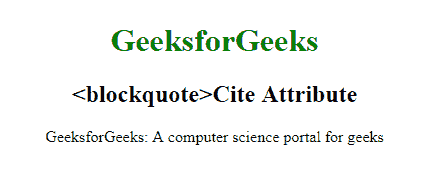

# HTML | blockquoteReference attribute

> 原文:[https://www . geesforgeks . org/html-block quote-cite-attribute/](https://www.geeksforgeeks.org/html-blockquote-cite-attribute/)

**HTML <区块引用>引用属性**用于*指定引用的来源*。

**语法:**

```html
<blockquote cite="URL"> 
```

**属性值:**

*   **URL:** 包含指定报价来源的值即 **URL** 。
    **Possible Values:**

*   **绝对 URL:** 指向另一个网站。*   **relative URL:** It points to a file within a website.

    **示例:**

    ```html
    <!DOCTYPE html>
    <html>

    <head>
        <title>
          HTML 
          <blockquote>Cite Attribute 
      </title>
        <style>
            body {
                text-align: center;
            }

            h1 {
                color: green;
            }
        </style>
    </head>

    <body>
        <h1>GeeksforGeeks</h1>
        <h2><blockquote>Cite  Attribute</h2>
        <blockquote cite="www.GeeksForGeeks.org.in">
          GeeksforGeeks: 
          A computer science portal for geeks
      </blockquote>
    </body>

    </html>
    ```

    **输出:**
    

    **支持的浏览器:**支持的浏览器 **HTML <区块引用>引用属性**如下:

    *   谷歌 Chrome
    *   微软公司出品的 web 浏览器
    *   火狐浏览器
    *   歌剧
    *   旅行队