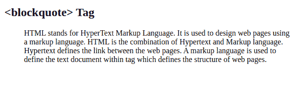
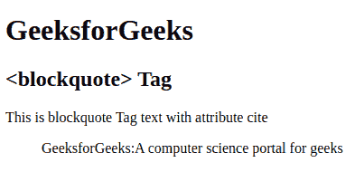

# HTML blockquotelabel

> 原文:[https://www.geeksforgeeks.org/html-blockquote-tag/](https://www.geeksforgeeks.org/html-blockquote-tag/)

HTML 中的

> Tags are used to display long references (parts from another source). It will change the alignment and make it different. It contains start and end tags. In the blockquote tag, we can use the title, list, paragraph and other elements.

**注意:**html 4.1 中的< blockquote >标签定义了长引号，即跨越多行的引号。但是在 HTML5 中，< blockquote >标签指定了从其他来源引用的部分。

**语法:**

```html
<blockquote> Contents... </blockquote>
```

**属性:**包含单个属性*引*，用于指定报价来源。

以下示例说明了块引用标记:

**示例 1:**

## 超文本标记语言

```html
<!DOCTYPE html>
<html>
  <body>
    <h1>GeeksforGeeks</h1>
    <h2><blockquote> Tag</h2>
    <!--blockquote Tag starts here -->
    <blockquote cite=
"https://www.geeksforgeeks.org/html-tutorials/">

<p>
        HTML stands for HyperText Markup Language. It 
        is used to design web pages using a markup language.
        HTML is the combination of Hypertext and Markup language.
        Hypertext defines the link between the web pages. A
        markup language is used to define the text document within 
        tag which defines the structure of web pages.
      </p>

    </blockquote>
    <!--blockquote Tag ends here -->
  </body>
</html>
```

**输出:**



**例 2:**

## 超文本标记语言

```html
<!DOCTYPE html>
<html>

<body>
    <h1>GeeksforGeeks</h1>
    <h2><blockquote> Tag</h2>

<p>This is blockquote Tag text with attribute cite</p>

    <!--blockquote Tag starts here -->
    <blockquote cite="www.geeksforgeeks.org">
        GeeksforGeeks:A computer science portal for geeks
    </blockquote>
    <!--blockquote Tag ends here -->
</body>

</html>
```

**输出:**



**支持的浏览器:**

*   谷歌 Chrome
*   微软公司出品的 web 浏览器
*   火狐浏览器
*   旅行队
*   歌剧