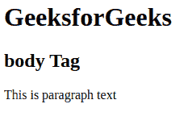
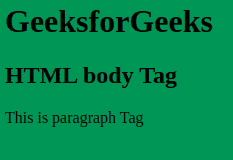

# HTML 标签

> 原文:[https://www.geeksforgeeks.org/html-body-tag/](https://www.geeksforgeeks.org/html-body-tag/)

HTML 中的标签用于定义 HTML 页面内部呈现的主要内容。它总是包含在标签中。标签是标签的最后一个孩子。正文标签包含开始标签和结束标签。

**语法:**

```html
<body> Body Contents... </body>
```

**属性:**在<体>标签中有很多属性是从 HTML5 中折下来的，如下所示:

*   [**背景**](https://www.geeksforgeeks.org/html-body-background-attribute/) **:** 包含背景图片的 URL。用于设置背景图像。
*   [**bgcolor**](https://www.geeksforgeeks.org/html-bgcolor-attribute/) **:用于指定图像的背景颜色。**
*   [**alink**](https://www.geeksforgeeks.org/html-body-alink-attribute/) **:用于指定活动链接的颜色。**
*   [**链接**](https://www.geeksforgeeks.org/html-links/) **:** 用于指定已访问链接的颜色。
*   [**文本**](https://www.geeksforgeeks.org/html-body-text-attribute/) **:** 它指定文档中文本的颜色。
*   [**vlink**](https://www.geeksforgeeks.org/html-body-vlink-attribute/) **:指定访问链接的颜色。**

**示例:**使用 HTML 正文标签。所有的内容都放在主体标签里面。

## 超文本标记语言

```html
<!DOCTYPE html>
<html>

<!-- body tag starts here -->
<body>
    <h1>GeeksforGeeks</h1>
    <h2>body Tag</h2>

<p>This is paragraph text</p>

</body>
<!-- body tag ends here -->

</html>
```

**输出:**



**示例 2:** 展示 Body 标签的功能及其 CSS 实现的示例。

## 超文本标记语言

```html
<!DOCTYPE html>
<html>

<!-- style on the body tag -->
<!-- body tag starts here -->
<body style="background-color:seagreen">
    <h1>GeeksforGeeks</h1>
    <h2>HTML body Tag</h2>

<p>This is paragraph Tag</p>

</body>
<!-- body tag ends here -->
</html>
```

**输出:**



**支持的浏览器:**

*   谷歌 Chrome
*   微软公司出品的 web 浏览器
*   火狐浏览器
*   歌剧
*   旅行队