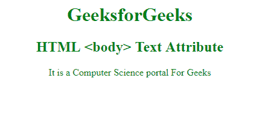

# HTML |正文属性

> 原文:[https://www.geeksforgeeks.org/html-body-text-attribute/](https://www.geeksforgeeks.org/html-body-text-attribute/)

**HTML <正文>文本属性**用于定义文档中文本的颜色。
**语法:**

```html
<body text="color_name | hex_number | rgb_number">
```

**属性值**

*   **color_name:** 指定文档中文本的颜色名称。
*   **十六进制数:**指定文档中文本颜色的十六进制代码。
*   **rgb_number:** 指定文档中文本的 rgb 值

**例:**

## 超文本标记语言

```html
<!DOCTYPE html>
<html>

<head>
    <title>HTML body Text Attribute</title>
</head>

<!-- body tag starts here -->

<body text="green">
    <center>
        <h1>GeeksforGeeks</h1>
        <h2>HTML <body> Text Attribute</h2>

<p>It is a Computer Science portal For Geeks</p>

    </center>
</body>
<!-- body tag ends here -->

</html>
```

**输出:**



**支持的浏览器:**正文>正文 T4 支持的浏览器如下:

*   谷歌 Chrome
*   微软公司出品的 web 浏览器
*   火狐浏览器
*   旅行队
*   歌剧