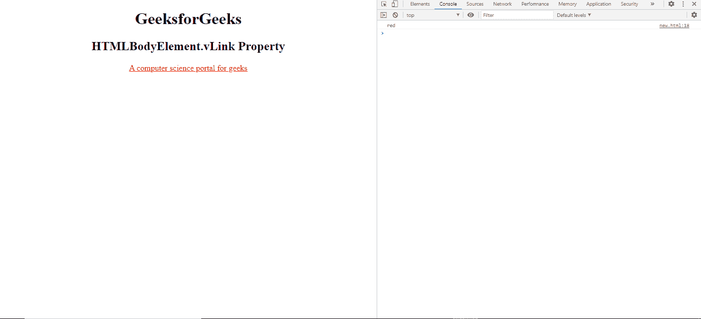
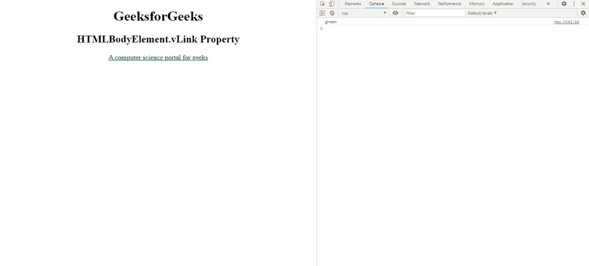

# HTML BodyElement.vLink 属性

> 原文:[https://www . geesforgeks . org/html-body element-vlink-property/](https://www.geeksforgeeks.org/html-bodyelement-vlink-property/)

属性用于返回一个表示被访问链接颜色的多字符串。

**语法:**

```html
BodyElement.vLink
```

**返回值:**这个属性返回一个表示被访问链接颜色的 DOMString 。

**例 1:**

## 超文本标记语言

```html
<!DOCTYPE html> 
<html> 

<!-- body tag starts here -->
<body vLink = "red">

    <center> 
        <h1>GeeksforGeeks</h1> 
        <h2>HTMLBodyElement.vLink Property</h2> 

        <a href = "https://www.geeksforgeeks.org/"> 
            A computer science 
            portal for geeks 
        </a> 
    </center> 

    <script type = "text/javascript">
        console.log(document.body.vLink);
    </script>
</body>

</html>
```

**输出:**



**例 2:**

## 超文本标记语言

```html
<!DOCTYPE html> 
<html> 

<!-- body tag starts here -->
<body vLink = "green">

    <center> 
        <h1>GeeksforGeeks</h1> 
        <h2>HTMLBodyElement.vLink Property</h2> 

        <a href = "https://www.geeksforgeeks.org/"> 
            A computer science 
            portal for geeks 
        </a> 
    </center> 

    <script type = "text/javascript">
        console.log(document.body.vLink);
    </script>
</body>

</html>
```

**输出:**



**支持的浏览器:**

*   谷歌 Chrome
*   微软公司出品的 web 浏览器
*   火狐浏览器
*   旅行队
*   歌剧
*   边缘