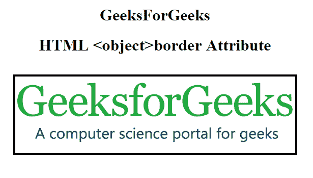

# HTML |边框属性

> 原文:[https://www.geeksforgeeks.org/html-border-attribute/](https://www.geeksforgeeks.org/html-border-attribute/)

**HTML 边框属性**用于设置正文内大部分 HTML 元素的可见边框宽度。

**语法:**

```html
<tag border="value">

```

**支持的标签:**

*   [表](https://www.geeksforgeeks.org/html-table-border-attribute/)
*   [图像](http://geeksforgeeks.org/html-img-border-attribute/)
*   [物体](https://www.geeksforgeeks.org/html-object-border-attribute/)

**示例:**表格边框属性。

## 超文本标记语言

```html
<!DOCTYPE html>
<html>

<head>
    <title>
        HTML table border Attribute
    </title>
</head>

<body>
    <h1>GeeksforGeeks</h1>

    <h2>HTML table border Attribute</h2>

    <table border="1">
        <caption>Author Details</caption>

        <tr>
            <th>NAME</th>
            <th>AGE</th>
            <th>BRANCH</th>
        </tr>
        <tr>
            <td>BITTU</td>
            <td>22</td>
            <td>CSE</td>
        </tr>
        <tr>
            <td>RAM</td>
            <td>21</td>
            <td>ECE</td>
        </tr>
    </table>
</body>

</html>
```

**输出:**


**示例:** Img 边框属性。

## 超文本标记语言

```html
<!DOCTYPE html>
<html>

<head>
    <title>
        HTML img border Attribute
    </title>
</head>

<body>
    <h1>GeeksforGeeks</h1>

    <h2>HTML img border Attribute</h2>

    
</body>

</html>
```

**输出:**


**示例:**对象边框属性。

## 超文本标记语言

```html
<!DOCTYPE html>
<html>

<head>
    <title>
        HTML object border Attribute
    </title>
</head>

<body>
    <center>
        <h1>GeeksForGeeks</h1>

        <h1>
            HTML <object> border Attribute
        </h1>
        <br>

        <object data=
"https://www.geeksforgeeks.org/wp-content/uploads/Geek_logi_-low_res.png"
                width="550px" height="150px" border="4">
            GeeksforGeeks
        </object>
    </center>
</body>

</html>
```

**输出:**



**支持的浏览器:****HTML 边框属性**支持的浏览器如下:

*   谷歌 Chrome
*   微软公司出品的 web 浏览器
*   火狐浏览器
*   苹果 Safari
*   歌剧