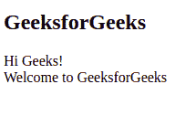
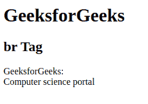

# HTML
标签

> 哎哎哎:# t0]https://www . geeksforgeeks . org/html-brgt 标签/

**示例:**在本例中，我们在 p 标签中使用 br 标签对内容进行换行。

## 超文本标记语言

```html
<!DOCTYPE html>
<html>

<body>
    <h2>GeeksforGeeks</h2>
    <!--br tag is used in below paragraph-->
    <p>Hi Geeks! <br>Welcome to GeeksforGeeks</p>
</body>

</html>
```

**输出:**



浏览器无法识别文本中新的行和段落格式。如果你想开始一个新的行，你需要借助
插入一个换行符。
标签在文档中插入单个回车或换行符。此元素没有结束标记。

让我们考虑一个例子。在记事本中键入以下不使用
标签的 HTML 代码，将文档保存为 HTML 文件，在浏览器中打开。您会注意到文本在四个实例中显示换行符，浏览器将整个文本显示为单个段落。
**语法:**

```html
<br>
```

**属性:**这个标签曾经接受一个名为 **clear 的属性，**

*   **clear:** 表示中断后下一行从哪里开始。

**示例:**

## 超文本标记语言

```html
<!DOCTYPE html>
<html>
    <body>
        <h1>GeeksforGeeks</h1>
        <h2>br Tag</h2>

        <!-- br tag is used here -->
        <p>GeeksforGeeks: <br> Computer science portal</p>

    </body>
</html>                    
```

**输出:**



**支持的浏览器:**

*   谷歌 Chrome 1 及以上版本
*   微软 Edge 12 及以上版本
*   微软公司出品的 web 浏览器
*   Firefox 1 及以上版本
*   旅行队
*   歌剧