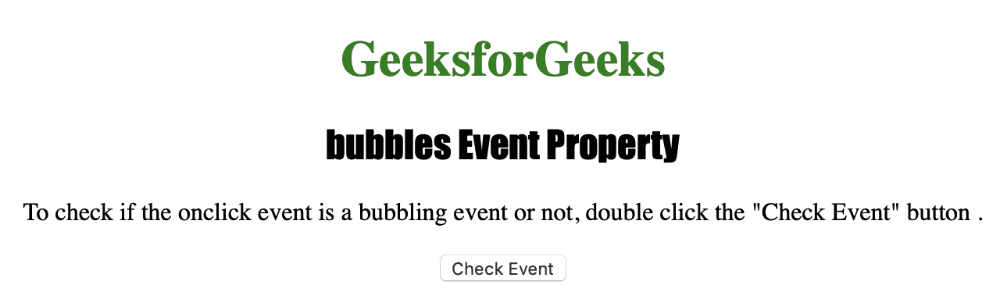
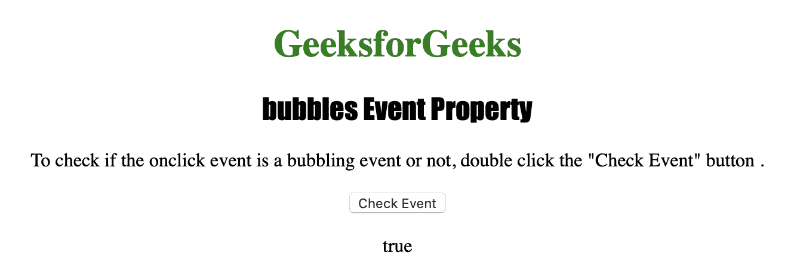

# HTML |气泡事件属性

> 原文:[https://www.geeksforgeeks.org/html-bubbles-event-property/](https://www.geeksforgeeks.org/html-bubbles-event-property/)

**冒泡事件**属性用于返回一个布尔值，该值指示事件是否是冒泡事件。如果为该对象设置了*事件处理程序*，则触发该事件，如果没有，则*事件气泡*上升到该对象的父对象。*事件冒泡*直至到达*文档对象*或*已处理*。
 **什么是事件冒泡？**考虑一个元素存在于另一个元素中，并且两者都处理一个事件的情况。当事件发生时，在冒泡中，最里面的元素首先处理事件，然后是外部元素，依此类推。详见[本](https://www.quirksmode.org/js/events_order.html)。

**返回值:****冒泡事件**属性返回*真*如果事件可以通过 DOM 冒泡，否则返回*假*。

**语法:**

```html
event.bubbles
```

下面的程序说明了**气泡**事件属性:

**示例:**找出特定事件是否会冒泡。

```html
<!DOCTYPE html>
<html>

<head>
    <title>bubbles Event Property in HTML</title>
    <style>
        h1 {
            color: green;
        }

        h2 {
            font-family: Impact;
        }

        body {
            text-align: center;
        }
    </style>
</head>

<body>

    <h1>GeeksforGeeks</h1>
    <h2>bubbles Event Property</h2>

    <p>To check if the onclick event is 
      a bubbling event or not, 
      double click the "Check Event" button.
    </p>

    <button ondblclick="MyEvent(event)">
      Check Event
    </button>

    <p id="test"></p>

    <script>
        function MyEvent(event) {
            <!-- Check whether the event is bubbling or not. -->
            var gfg = event.bubbles;
            document.getElementById("test").innerHTML = gfg;
        }
    </script>

</body>

</html>
```

**输出:**

**点击按钮前:**


**点击按钮后:**


**支持的浏览器:**

*   歌剧
*   微软公司出品的 web 浏览器
*   谷歌 Chrome
*   火狐浏览器
*   苹果 Safari