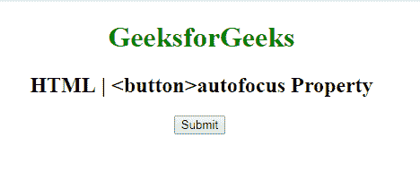

# HTML | button 自动对焦属性

> 原文:[https://www . geesforgeks . org/html-button-autofocus-attribute/](https://www.geeksforgeeks.org/html-button-autofocus-attribute/)

**HTML | <按钮>自动对焦属性**用于指定*按钮在页面加载*时是否自动对焦。它是一个布尔属性。

**语法:**

```html
<button type="button" autofocus> 
```

**示例:**本示例说明了按钮元素中自动对焦属性的使用。

```html
<!DOCTYPE html>
<html>

<head>
    <title>
        HTML | 
      <button>autofocus Attribute
    </title>
</head>

<body style="text-align:center">

    <h1 style="color: green;"> 
        GeeksforGeeks 
    </h1>

    <h2> 
        HTML |  
      <button>autofocus Property 
    </h2>

    <!-- Assign id to the Button. -->
    <button id="GFG"
            autofocus>
        Submit
    </button>

    <br>
</body>

</html>
```

**输出:**


**支持的浏览器:**以下是 **HTML | <按钮>自动对焦属性**支持的浏览器:

*   谷歌 Chrome
*   微软公司出品的 web 浏览器
*   火狐浏览器
*   歌剧
*   旅行队