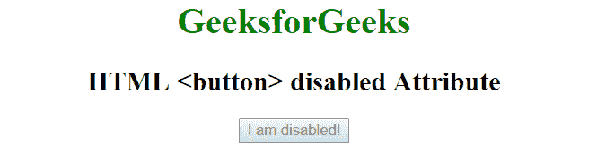

# HTML button 禁用属性

> 原文:[https://www . geesforgeks . org/html-button-disabled-attribute/](https://www.geeksforgeeks.org/html-button-disabled-attribute/)

HTML 中<按钮>元素的**禁用**属性用于指定按钮被禁用。禁用的按钮不可点击且不可用。它是一个布尔属性。

**语法:**

```html
<button disabled></button>

```

**示例:**

```html
<!DOCTYPE html> 
<html> 
    <head> 
        <title>HTML  <button> disabled Attribute</title> 
    </head> 
    <body style = "text-align:center">    
        <h1 style = "color: green;">GeeksforGeeks</h1>
        <h2>HTML <button> disabled Attribute</h2>

        <!--A disabled button-->
        <button type="button" disabled>I am disabled!</button>
    </body> 
</html>    

```

**输出:**


**支持的浏览器:**禁用属性<按钮>支持的浏览器如下:

*   苹果 Safari
*   谷歌 Chrome
*   火狐浏览器
*   歌剧
*   微软公司出品的 web 浏览器