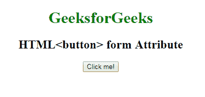

# HTML | button 表单属性

> 原文:[https://www.geeksforgeeks.org/html-button-form-attribute/](https://www.geeksforgeeks.org/html-button-form-attribute/)

**HTML <按钮>表单属性**用于指定*一个或多个<按钮>元素所属的表单*。

**语法:**

```html
<button form="form_id"> 
```

**属性值:**

*   **form_id:** 包含指定按钮元素所属的一个或多个的值，即 **form_id** 。该属性的值应该是<表单>元素的 id。

**示例:**

```html
<!DOCTYPE html>
<html>

<head>
    <title>
      HTML | <button> 
      form Attribute
  </title>
</head>

<body style="text-align:center">
    <h1 style="color:green;"> 
            GeeksforGeeks 
        </h1>

    <h2> 
            HTML<button> 
      form Attribute 
        </h2>

    <form id="myGeeks">
    </form>

    <button id="btn" 
            name="myGeeks" 
            form="myGeeks" 
            onclick="geek()">
        Click me!</button>

</body>

</html>
```

**输出:**


**支持的浏览器:**支持的浏览器 **HTML | <按钮>表单属性**如下:

*   谷歌 Chrome
*   微软公司出品的 web 浏览器
*   火狐浏览器
*   歌剧
*   旅行队