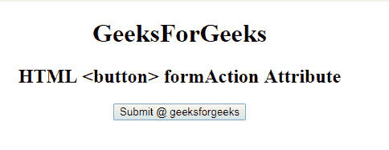

# HTML | button 表单属性

> 原文:[https://www . geesforgeks . org/html-button-formaction-attribute/](https://www.geeksforgeeks.org/html-button-formaction-attribute/)

**HTML <按钮>表单属性**用于指定表单数据的发送位置。提交表单后，表单属性被调用。表单数据将在提交表单后发送到服务器。它覆盖了<表单>元素的动作属性的特征。

**语法:**

```html
<button type="submit" formaction="URL"> 
```

**属性值:**包含单值 URL，用于指定表单提交后要发送数据的文档的 URL。

网址的可能值有:

*   **绝对 URL:** 它指向一个页面的完整地址。例如:www.geeksforgeeks.org/data-structure
*   **相对网址:**用于指向网页中的文件。例如:gfg.php

**示例:**

```html
<!DOCTYPE html>
<html>

<head>
    <title>
        HTML <Button> formAction Attribute
    </title>
</head>

<body style="text-align:center;">
    <h1> 
        GeeksForGeeks 
    </h1>

    <h2> 
        HTML  <button> formAction Attribute 
    </h2>

    <form action="#" method="get" target="_self">
        <input type="submit"
               id="Geeks"
               name="myGeeks"
               value="Submit @ geeksforgeeks" 
               formTarget="_blank" 
               formMethod="post"
               formAction="test.php">
    </form>
</body>

</html>
```

**输出:**


**支持的浏览器:****HTML 按钮表单属性**支持的浏览器如下:

*   谷歌 Chrome
*   微软公司出品的 web 浏览器
*   火狐浏览器
*   苹果 Safari
*   歌剧