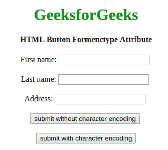

# HTML | button 表单类型属性

> 原文:[https://www . geesforgeks . org/html-button-formenctype-attribute/](https://www.geeksforgeeks.org/html-button-formenctype-attribute/)

**HTML <按钮>表单类型属性**用于指定表单数据提交到服务器时需要编码。此属性将覆盖 formencrypt 属性的功能。只能与**按钮配合使用。**

**语法:**

```html
<button type="submit" formenctype="value">
```

**属性值:**该属性包含以下三个值:

*   **application/x-www-form-URL encoded:**为默认值。它在发送到服务器之前对所有字符进行编码。它将空格转换为+符号，将特殊字符转换为十六进制值。
*   **多部分/表单数据:**该值不编码任何字符。
*   **文本/普通:**该值将空格转换为+符号，但不转换特殊字符。

**示例:**本示例说明了在<按钮>元素中 enctype 属性的使用。

## 超文本标记语言

```html
<!DOCTYPE html>
<html>

<head>
    <title>
     Button Formenctype attribute
    </title>
</head>

<body style="text-align: center">
    <h1 style="color: green">GeeksforGeeks</h1>
    <h4>HTML Button Formenctype Attribute</h4>
    <form action="#" method="post"
          formenctype="multipart/form-data">
        First name:
        <input type="text" name="fname">
        <br><br>
        Last name:
        <input type="text" name="lname">
        <br><br>
        Address:
        <input type="text" name="Address">
        <br><br>
        <button type="submit">
          submit without character encoding
        </button>
        <br>
        <br>
        <button type="submit" formenctype="text/plan">
          submit with character encoding
        </button>
    </form>
</body>

</html>
```

**输出:**



**支持的浏览器:**支持的浏览器 *HTML <按钮> formenctype 属性*如下:

*   谷歌 Chrome 10.0
*   Internet Explorer 10.0
*   Firefox 4.0
*   歌剧 10.6
*   Safari 5.1