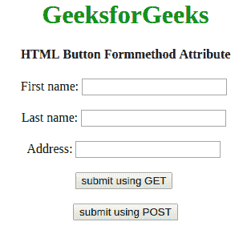

# HTML | button 表单方法属性

> 原文:[https://www . geesforgeks . org/html-button-form method-attribute/](https://www.geeksforgeeks.org/html-button-formmethod-attribute/)

**HTML 按钮表单方法属性**用于指定提交表单时发送数据的 HTTP 方法。HTTP 方式有两种，分别是 **GET** 和 **POST** 。该属性仅用于**按钮类型=“提交”**

**语法:**

```html
<button type="submit" formmethod="get|post">
```

**属性值:**

*   **GET:** 在 GET 方法中，表单提交后，表单值会在新浏览器选项卡的地址栏中可见。它的大小限制在 3000 个字符左右。它仅适用于非安全数据，不适用于敏感信息。
*   **POST:** 在 POST 方法中，表单提交后，表单值在新浏览器选项卡的地址栏中将不会像在 GET 方法中一样可见。它将表单数据追加到 HTTP 请求的正文中。它没有大小限制。此方法不支持对结果添加书签。

**示例:**本示例说明了**按钮**元素中 formmethod 属性的使用。

```html
<!DOCTYPE html>
<html>

<head>
    <title> 
      Button Formmethod attribute
    </title>
</head>

<body style="text-align: center">
    <h1 style="color: green">
      GeeksforGeeks
    </h1>
    <h4>
      HTML Button Formmethod Attribute
    </h4>
    <form action="#" method="post" 
          enctype="multipart/form-data">
        First name:
        <input type="text" name="fname">
        <br><br>
        Last name:
        <input type="text" name="lname">
        <br><br>
        Address:
        <input type="text" name="Address">
        <br><br>
        <button type="submit" formmethod="GET">
          submit using GET 
        </button>
        <br>
        <br>
        <button type="submit" formenctype="text/plan" 
                formmethod="POST">
          submit using POST
        </button>
    </form>
</body>

</html>
```

**输出:**

**支持的浏览器:**HTML<按钮> Formmethod 属性支持的浏览器如下:

*   谷歌 Chrome 9.0
*   Internet Explorer 10.0
*   Firefox 4.0
*   歌剧 10.6
*   Safari 5.1