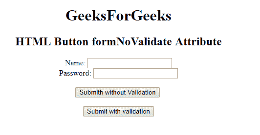

# HTML | button formnovalidate 属性T3】

> 原文:[https://www . geeksforgeeks . org/html-button-formnovalidate-attribute/](https://www.geeksforgeeks.org/html-button-formnovalidate-attribute/)

**HTML <按钮>表单更新属性**用于指定提交表单时不验证表单数据。该属性是布尔属性。它会覆盖表单的新数据属性的功能。只能与 **<按钮配合使用。**

**语法:**

```html
<button type="submit" formnovalidate>
```

**示例:**本示例说明了<按钮>元素中 formnovalidate 属性的使用。

```html
<!DOCTYPE html>
<html>

<head>
    <title>
        HTML Button formNoValidate Attribute
    </title>
</head>

<body style="text-align:center;">
    <h1> 
        GeeksForGeeks 
    </h1>

    <h2> 
        HTML Button formNoValidate Attribute 
    </h2>

    <form action="#"
          method="get" 
          target="_self">
        Name:
        <input type="text">
        <br> Password:
        <input type="password">
        <br>
        <br>
        <button type="submit" 
                id="Geeks"
                name="myGeeks" 
                value="Submit @ geeksforgeeks" 
                formTarget="_blank"
                Formnovalidate>
            Submith without Validation
        </button>
        <br>
        <br>
        <button type="submit">
          Submit with validation
      </button>
    </form>

</body>

</html>
```

**输出:**


**支持的浏览器:**支持的浏览器 **HTML Button formnovalidate 属性**如下:

*   谷歌 Chrome 10.0
*   Internet Explorer 10.0
*   Firefox 4.0
*   歌剧 10.6