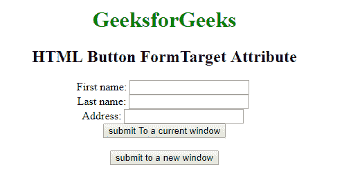

# HTML | button formtarget 属性

> 原文:[https://www . geesforgeks . org/html-button-formtarget-attribute/](https://www.geeksforgeeks.org/html-button-formtarget-attribute/)

**HTML 按钮表单目标属性**用于指定提交的结果将在**当前窗口、新选项卡还是新框架中打开。**该属性覆盖<形态>目标属性的特征。只能和
按钮一起使用【语法:

```html
<button type="submit" formtarget="_blank | _self | _parent | _top | framename">
```

**属性值**

*   **_blank:** 在新窗口打开链接。

*   **_self:** 在同一框架中打开链接的文档。
*   **_parent:** 打开父框架集中的链接文档。
*   **_top:** 在窗口的整个正文中打开链接的文档。
*   **框架名称:**在命名框架中打开链接文档。

**示例:**本示例说明了按钮元素中 formTarget 属性的使用。

## 超文本标记语言

```html
<!DOCTYPE html>
<html>

<head>
    <title>
      Button FormTarget attribute
  </title>
</head>

<body style="text-align: center">
    <h1 style="color: green">
      GeeksforGeeks
  </h1>
    <h2>HTML Button FormTarget
      Attribute</h2>
    <form action="#"
          method="post"
          enctype="multipart/form-data">
        First name:
        <input type="text"
               name="fname">
        <br> Last name:
        <input type="text"
               name="lname">
        <br> Address:
        <input type="text"
               name="Address">
        <br>
        <button type="submit"
                formtarget="_self">
          submit To a current window
      </button>
        <br>
        <br>
        <button type="submit"
                formenctype="text/plan"
                formtarget="_blank">
          submit to a new window
      </button>
    </form>
</body>

</html>
```

**输出:**



**支持的浏览器:**HTML 按钮 FormTarget 属性支持的浏览器如下:

*   谷歌 Chrome 10.0
*   Internet Explorer 10.0
*   Firefox 4.0
*   歌剧 10.6
*   苹果 Safari 5.1