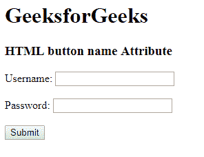

# HTML | button 名称属性

> 原文:[https://www.geeksforgeeks.org/html-button-name-attribute/](https://www.geeksforgeeks.org/html-button-name-attribute/)

<button>名称属性用于指定</button><button>元素的名称属性。它用于在提交表单后引用表单数据，或者引用 JavaScript 中的元素。</button>

**语法:**

```html
<button name="name">
```

**属性值:**它包含单个值**名称**，该名称描述了<按钮>元素的名称。

**示例:**

```html
<!DOCTYPE html> 
<html> 
    <head> 
        <title>
            HTML button name Attribute
        </title> 
    </head> 

    <body>
        <h1>GeeksforGeeks</h1>

        <h3>HTML button name Attribute</h3> 

        <form action="#" method="get">
            Username: <input type="text" name="uname">

            <br><br>

            Password: <input type="password" name="pwd">

            <br><br>

            <button type="submit" value="submit">
                Submit
            </button>
        </form>
    </body> 
</html>                    
```

**输出:**


**支持的浏览器:**HTML<按钮>名称属性支持的浏览器如下:

*   谷歌 Chrome
*   微软公司出品的 web 浏览器
*   火狐浏览器
*   旅行队
*   歌剧