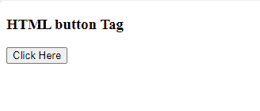

# HTML button 标签

> 原文:[https://www.geeksforgeeks.org/html-button-tag/](https://www.geeksforgeeks.org/html-button-tag/)

HTML 中的<button>标签用来定义可点击的按钮。</button><button>标签用于提交内容。图像和文本内容可以在</button><button>标签内使用。不同的浏览器对</button><button>使用不同的默认类型。按钮可以使用 CSS 来设置样式。</button>

**语法:**

```html
<button type = "button">
```

**属性:**可与“按钮”标签一起使用的各种属性如下:

*   [自动对焦](https://www.geeksforgeeks.org/html-button-autofocus-attribute/):用于指定页面加载时按钮是否自动对焦
*   [禁用](https://www.geeksforgeeks.org/html-disabled-attribute/):用于表示元件是否禁用。如果设置了此属性，元素将被禁用。
*   [表单](https://www.geeksforgeeks.org/html-form-tag/):用于创建用户输入的表单。>在>表单标签中使用了许多元素。
*   [表单](https://www.geeksforgeeks.org/html-button-formaction-attribute/):用于指定表单数据发送到哪里。
*   [表单验证](https://www.geeksforgeeks.org/html-input-formnovalidate-attribute/):用于指定提交表单时不验证输入元素。
*   [表单类型](https://www.geeksforgeeks.org/html-button-formenctype-attribute/):用于指定表单数据在提交给服务器时需要编码。
*   [表单方法](https://www.geeksforgeeks.org/html-button-formmethod-attribute/):用于指定提交表单时发送数据的 HTTP 方法。
*   [表单目标](https://www.geeksforgeeks.org/html-input-formtarget-attribute/):用于指定提交表单后显示响应的名称或关键字。
*   [类型](https://www.geeksforgeeks.org/html-type-attribute/):用于指定按钮元素的按钮类型。它也用于<输入>元素，以指定要显示的输入类型。
*   [值](https://www.geeksforgeeks.org/html-value-attribute/):用于指定使用它的元素的值。对于不同的 HTML 元素有不同的含义。

**示例:**下面的示例解释了 HTML 按钮标签。

## 超文本标记语言

```html
<!DOCTYPE html>
<html>
    <body>
        <h3>HTML button Tag</h3>

        <!-- button tag starts from here -->
        <button type = "button" onclick = 
            "alert('Welcome to GeeksforGeeks')">
            Click Here
        </button>
        <!-- button tag ends here -->

    </body>
</html>                    
```

**输出:**



**支持的浏览器:**

*   谷歌 Chrome
*   微软公司出品的 web 浏览器
*   火狐浏览器
*   旅行队
*   歌剧