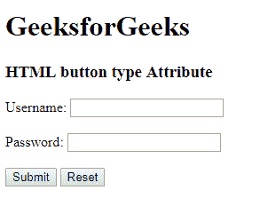

# HTML | button 类型属性

> 原文:[https://www.geeksforgeeks.org/html-button-type-attribute/](https://www.geeksforgeeks.org/html-button-type-attribute/)

<button>类型属性用于指定按钮的类型。它指定了</button><button>元素的类型属性。</button><button>元素的默认类型因浏览器而异。</button>

**语法:**

```html
<button type="button|submit|reset">
```

**属性值:**

*   **提交:**定义一个提交按钮。除了 Internet Explorer 之外，它对所有浏览器都有默认值。
*   **按钮:**定义一个可点击的按钮。它有一个互联网浏览器的默认值。
*   **复位:**定义了一个复位按钮，用于改变表单中之前的数据。

**示例:**

```html
<!DOCTYPE html> 
<html> 
    <head> 
        <title>
            HTML button type Attribute
        </title> 
    </head> 

    <body>
        <h1>GeeksforGeeks</h1>

        <h3>HTML button type Attribute</h3> 

        <form action="#" method="get">
            Username: <input type="text" name="uname">

            <br><br>

            Password: <input type="password" name="pwd">

            <br><br>

            <button type="submit" value="submit">
                Submit
            </button>

            <button type="reset" value="reset">
                Reset
            </button>
        </form>
    </body> 
</html>                                             
```

**输出:**


**支持的浏览器:**HTML<按钮>类型属性支持的浏览器如下:

*   谷歌 Chrome
*   微软公司出品的 web 浏览器
*   火狐浏览器
*   旅行队
*   歌剧