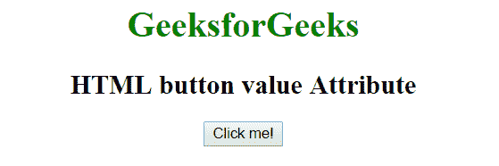
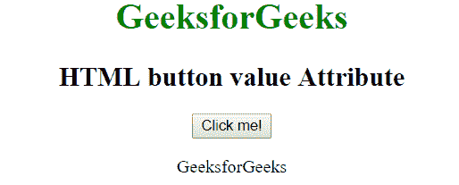

# HTML button 值属性

> 原文:[https://www.geeksforgeeks.org/html-button-value-attribute/](https://www.geeksforgeeks.org/html-button-value-attribute/)

HTML 中<按钮>元素的**值**属性用于指定按钮元素的初始值。

**语法:**

```html
<button value = "value">
```

**示例:**

```html
<!DOCTYPE html>
<html>
    <head>
        <title>HTML button value Attribute</title>
    </head>
    <body style = "text-align:center">
        <h1 style = "color:green;">
            GeeksforGeeks
        </h1>

        <h2>
            HTML button value Attribute
        </h2>

        <button id="btn" value="GeeksforGeeks" onclick="geek()">
         Click me!</button>

        <p id="g"></p>

        <script>
            function geek() {
              var x = document.getElementById("btn").value;
              document.getElementById("g").innerHTML =  x;
            }
        </script>
    </body>
</html>
```

**输出:**
**点击按钮前:**

**点击按钮后:**

**支持的浏览器:**按钮元素中值属性支持的浏览器如下:

*   苹果 Safari
*   谷歌 Chrome
*   火狐浏览器
*   歌剧
*   微软公司出品的 web 浏览器