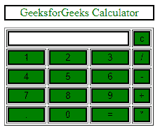
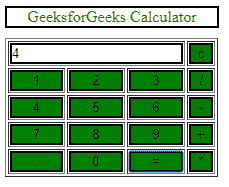

# HTML |计算器

> 原文:[https://www.geeksforgeeks.org/html-calculator/](https://www.geeksforgeeks.org/html-calculator/)

这里的计算器将由 HTML 代码组成。

*   **计算器标题**:这是我们应用程序顶部的标题，“GeeksforGeeks 计算器”。
*   **Output Screen**: This will be our output screen, where all text will be shown. Like the input that the user will type and the answer calculated from the user input. So, we can again break down this into two smaller pieces as shown below:
    *   **问题输出**:这将是用户给出的输入。
    *   **答案输出**:这将是根据用户输入计算的结果。

    **HTML 代码:**

    ```html
    <html>
       <head>
          <script>
             //function that display value
             function dis(val)
             {
                 document.getElementById("result").value+=val
             }

             //function that evaluates the digit and return result
             function solve()
             {
                 let x = document.getElementById("result").value
                 let y = eval(x)
                 document.getElementById("result").value = y
             }

             //function that clear the display
             function clr()
             {
                 document.getElementById("result").value = ""
             }
          </script>
          <!-- for styling -->
          <style>
             .title{
             margin-bottom: 10px;
             text-align:center;
             width: 210px;
             color:green;
             border: solid black 2px;
             }

             input[type="button"]
             {
             background-color:green;
             color: black;
             border: solid black 2px;
             width:100%
             }

             input[type="text"]
             {
             background-color:white;
             border: solid black 2px;
             width:100%
             }
          </style>
       </head>
       <!-- create table -->
       <body>
          <div class = title >GeeksforGeeks Calculator</div>
          <table border="1">
             <tr>
                <td colspan="3"><input type="text" id="result"/></td>
                <!-- clr() function will call clr to clear all value -->
                <td><input type="button" value="c" onclick="clr()"/> </td>
             </tr>
             <tr>
                <!-- create button and assign value to each button -->
                <!-- dis("1") will call function dis to display value -->
                <td><input type="button" value="1" onclick="dis('1')"/> </td>
                <td><input type="button" value="2" onclick="dis('2')"/> </td>
                <td><input type="button" value="3" onclick="dis('3')"/> </td>
                <td><input type="button" value="/" onclick="dis('/')"/> </td>
             </tr>
             <tr>
                <td><input type="button" value="4" onclick="dis('4')"/> </td>
                <td><input type="button" value="5" onclick="dis('5')"/> </td>
                <td><input type="button" value="6" onclick="dis('6')"/> </td>
                <td><input type="button" value="-" onclick="dis('-')"/> </td>
             </tr>
             <tr>
                <td><input type="button" value="7" onclick="dis('7')"/> </td>
                <td><input type="button" value="8" onclick="dis('8')"/> </td>
                <td><input type="button" value="9" onclick="dis('9')"/> </td>
                <td><input type="button" value="+" onclick="dis('+')"/> </td>
             </tr>
             <tr>
                <td><input type="button" value="." onclick="dis('.')"/> </td>
                <td><input type="button" value="0" onclick="dis('0')"/> </td>
                <!-- solve function call function solve to evaluate value -->
                <td><input type="button" value="=" onclick="solve()"/> </td>
                <td><input type="button" value="*" onclick="dis('*')"/> </td>
             </tr>
          </table>
       </body>
    </html>   
    ```

    **输出:**
    刚开始-
    
    输入一些数据后-
    
    最后结果会像-
    