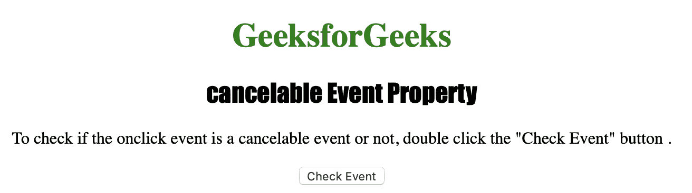
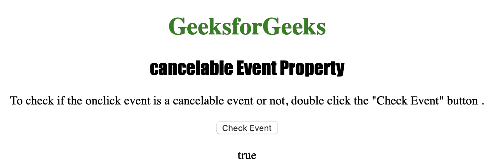

# HTML |可取消事件属性

> 原文:[https://www . geesforgeks . org/html-cancelable-event-property/](https://www.geeksforgeeks.org/html-cancelable-event-property/)

**可取消事件**属性用于返回一个布尔值，该值指示事件是否为可取消事件。如果可以阻止事件的默认操作，则事件是可取消的事件。

**返回值:**
**可取消事件**属性返回 *true* 如果事件可取消，否则返回 *false* 。

**语法:**

```html
event.cancelable
```

下面的程序说明了可取消事件属性:

**示例:**确定某个特定事件是否可取消。

```html
<!DOCTYPE html>
<html>

<head>
    <title>cancelable Event Property in HTML</title>
    <style>
        h1 {
            color: green;
        }

        h2 {
            font-family: Impact;
        }

        body {
            text-align: center;
        }
    </style>
</head>

<body>

    <h1>GeeksforGeeks</h1>
    <h2>cancelable Event Property</h2>

    <p>To check if the onclick event is 
       a cancelable event or not, 
       double click the "Check Event" button .
    </p>

    <button ondblclick="MyEvent(event)">
        Check Event
    </button>

    <p id="test"></p>

    <script>
        function MyEvent(event) {
            <!-- Check whether the "event" is cancelable or not. -->
            var gfg = event.cancelable;

            document.getElementById("test").innerHTML = gfg;
        }
    </script>

</body>

</html>       
```

**输出:**

**点击按钮前:**


**双击按钮后(注意按钮下方有文字“真”):**


**支持的浏览器:**

*   歌剧
*   微软公司出品的 web 浏览器
*   谷歌 Chrome
*   火狐浏览器
*   苹果 Safari