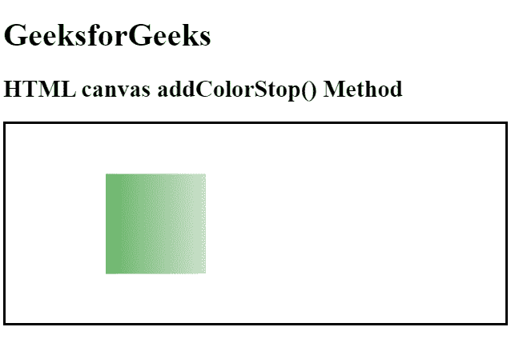

# HTML |画布 addColorStop()方法

> 原文:[https://www . geesforgeks . org/html-canvas-addcolorstop-method/](https://www.geeksforgeeks.org/html-canvas-addcolorstop-method/)

**addColorStop()** 方法用于指定颜色及其在渐变对象中的位置。

**语法:**

```html
gradient.addColorStop(stop, color);
```

**参数:**

*   **stop:** 它是一个介于 0.0 和 1.0 之间的值，表示渐变中开始和结束之间要保持的位置。
*   **颜色:**是要在停止位置显示的颜色值。

**示例:**

```html
<!DOCTYPE html>
<html>

<head>
    <title>
        HTML canvas addColorStop() Method
    </title>
</head>

<body style="text-align:left;">

    <h1>GeeksforGeeks</h1>

    <h2>HTML canvas addColorStop() Method</h2>

    <canvas id="GFG" width="500" height="200"
    style="border:2px solid" >
    </canvas>

    <script>
        var doc_id = document.getElementById("GFG");
        var context = doc_id.getContext("2d");

// Create gradient
var grad = context.createLinearGradient(0, 0, doc_id.width, 0);
grad.addColorStop("0", "green");
grad.addColorStop("0.5", "white");
grad.addColorStop("1.0", "green");
// Fill with gradient
context.fillStyle = grad;
context.fillRect(100, 50, 100, 100);
    </script>
</body>

</html>                                                                        
```

**输出:**


**支持的浏览器:**以下是 **HTML 画布 addColorStop()方法**支持的浏览器:

*   谷歌 Chrome
*   Internet Explorer 9.0
*   火狐浏览器
*   旅行队
*   歌剧