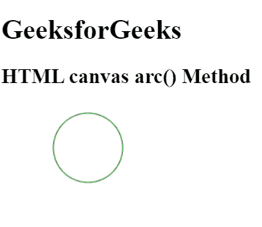
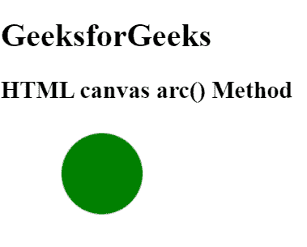

# HTML |画布弧()方法

> 原文:[https://www.geeksforgeeks.org/html-canvas-arc-method/](https://www.geeksforgeeks.org/html-canvas-arc-method/)

**圆弧()方法**用于创建圆弧/曲线，即圆或圆的一部分。

**语法:**

```html
context.arc(x, y, r, sAngle, eAngle, counterclockwise);
```

**参数:**

*   **x:** 此参数指定圆心的 x 坐标。
*   **y:** 此参数指定圆心的 y 坐标。
*   **r:** 此参数指定圆的半径。
*   **桑乐:**此参数指定起始角度，单位为弧度(弧的圆的 3 点钟位置表示 0)。
*   **角度:**该参数以弧度为单位指定结束角度。
*   **逆时针:**该参数指定绘图应该是顺时针还是逆时针。默认为假，表示顺时针方向。

**例 1:**

```html
<!DOCTYPE html>
<html>

<head>
    <title>
        HTML canvas arc() Method
    </title>
</head>

<body style="text-align:left;">

    <h1>GeeksforGeeks</h1>

    <h2>HTML canvas arc() Method</h2>

    <canvas id="GFG" width="500" height="200">
    </canvas>

    <script>
        var doc_id = document.getElementById("GFG");
        var context = doc_id.getContext("2d");
        context.beginPath();
        context.strokeStyle = 'green';
        context.arc(100, 50, 40, 0, 2 * Math.PI);
        context.stroke();
    </script>
</body>

</html>
```

**输出:**


**例 2:**

```html
<!DOCTYPE html>
<html>

<head>
    <title>
        HTML canvas arc() Method
    </title>
</head>

<body style="text-align:left;">

    <h1>GeeksforGeeks</h1>

    <h2>HTML canvas arc() Method</h2>

    <canvas id="GFG" width="500" height="200">
    </canvas>

    <script>
        var doc_id = document.getElementById("GFG");
        var context = doc_id.getContext("2d");
        context.beginPath();
        context.fillStyle = 'green';
        context.arc(100, 50, 40, 0, 2 * Math.PI);
        context.fill();
    </script>
</body>

</html>
```

**输出:**


**支持的浏览器:****HTML 画布 arc()方法**支持的浏览器如下:

*   谷歌 Chrome
*   Internet Explorer 9.0
*   火狐浏览器
*   旅行队
*   歌剧