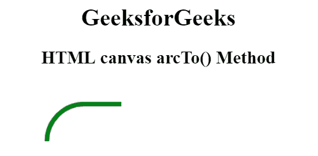
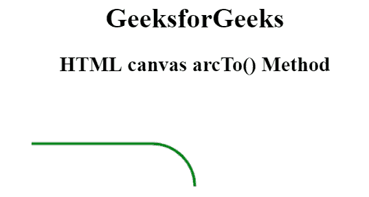

# HTML |画布 arcTo()方法

> 原文:[https://www.geeksforgeeks.org/html-canvas-arcto-method/](https://www.geeksforgeeks.org/html-canvas-arcto-method/)

**画布 arcTo()方法**用于在画布上的两条切线之间创建圆弧/曲线。此方法在直线或其他图形的延长线上定义圆弧。这种方法通常用于创建圆角。

**语法:**

```html
context.arcTo( x1, y1, x2, y2, r );
```

**参数:**

*   **x1:** 此参数指定第一条切线的 x 坐标。
*   **y1:** 此参数指定第一条切线的 y 坐标。
*   **x2:** 此参数指定第二条切线的 x 坐标。
*   **y2:** 此参数指定第二条切线的 y 坐标。
*   **r:** 此参数指定圆弧的半径。

**例 1:**

```html
<!DOCTYPE html>
<html>

<head>
    <title>
        HTML canvas arcTo() Method
    </title>
</head>

<body style="text-align:center;">

    <h1>GeeksforGeeks</h1>

    <h2>HTML canvas arcTo() Method</h2>

    <canvas id="GFG" width="500" height="200" >
    </canvas>

    <script>
        var doc_id = document.getElementById("GFG");
        var context = doc_id.getContext("2d");
        context.beginPath();
        context.strokeStyle = 'green';
        context.lineWidth = 6;
        context.moveTo(200, 30);
        context.arcTo(100, 30, 100, 50, 50);
        context.stroke();
    </script>
</body>

</html>
```

**输出:**


**例 2:**

```html
<!DOCTYPE html>
<html>

<head>
    <title>
        HTML canvas arcTo() Method
    </title>
</head>

<body style="text-align:center;">

    <h1>GeeksforGeeks</h1>

    <h2>HTML canvas arcTo() Method</h2>

    <canvas id="GFG" width="500" height="200" >
    </canvas>

    <script>
        var doc_id = document.getElementById("GFG");
        var context = doc_id.getContext("2d");
        context.beginPath();
        context.strokeStyle = 'green';
        context.lineWidth = 3;
        context.moveTo(60, 60);
        context.arcTo(250, 60, 250, 110, 50);
        context.stroke();
    </script>
</body>

</html>
```

**输出:**


**支持的浏览器:**HTML 画布 arcTo()方法支持的浏览器如下:

*   谷歌 Chrome
*   Internet Explorer 9.0
*   火狐浏览器
*   旅行队
*   歌剧