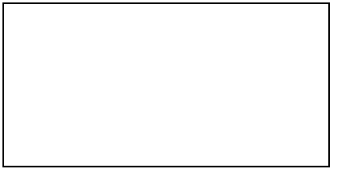
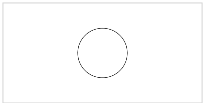
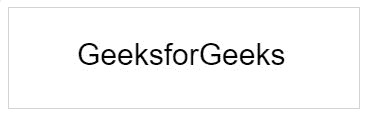
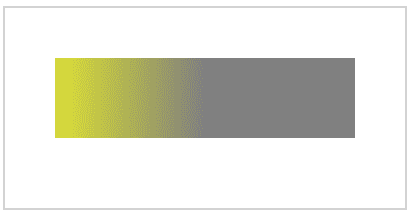
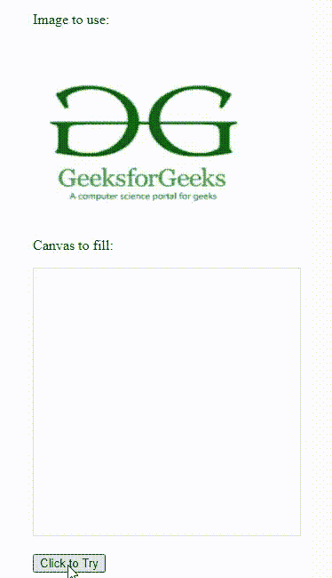
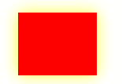
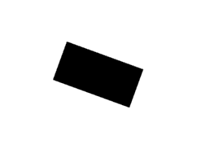
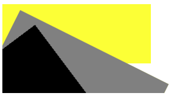

# HTML 画布基础

> 原文:[https://www.geeksforgeeks.org/html-canvas-basics/](https://www.geeksforgeeks.org/html-canvas-basics/)

**示例:**该示例说明了在 HTML 中使用带有线性渐变&笔画样式文本的画布。

## 超文本标记语言

```html
<html>

<body>
    <canvas id="gfg" 
            width="300px" 
            height="100px" 
            style="border:1px solid #d3d3d3;"> 
    </canvas>
    <script>
        var g = document.getElementById("gfg");
        var geeks = g.getContext("2d");
        var gradient = geeks.createLinearGradient(1, 4, g.width, 2);
        gradient.addColorStop("0", "green");
        gradient.addColorStop("0.4", "yellow");
        gradient.addColorStop("1.0", "aqua");
        geeks.font = "40px sans-serif";
        geeks.fillStyle = "red";
        geeks.strokeStyle = gradient;
        geeks.strokeText("GeeksforGeeks", 10, 60);
    </script>
</body>

</html>
```

**输出:**


HTML“画布”元素用于通过 JavaScript 绘制图形。“画布”元素只是一个图形容器。人们必须使用 JavaScript 来实际绘制图形。Canvas 有几种绘制路径、框、圆、文本和添加图像的方法。画布将是 HTML 页面上的一个矩形区域。默认情况下，画布没有边框和内容。

**语法:**

```html
<canvas>
    Content...
</canvas>
```

建议使用 id 属性(在脚本中引用)，宽度和高度属性来定义画布的大小。若要添加边框，请使用样式属性。

**支持的属性:**颜色、样式、阴影、线条样式、矩形、路径、变换、文本、像素操作、合成&图像绘制等属性是所有画布标签支持的全局属性。详情请参考 [HTML 画布完整参考](https://www.geeksforgeeks.org/html-canvas-complete-reference/)文章。

**示例:**下面的代码演示了空画布。

## 超文本标记语言

```html
<!DOCTYPE html>
<html>

<body>
    <canvas id="myCanvas" 
            width="400" 
            height="200" 
            style="border:2px solid #000000;"> 
    </canvas>
</body>

</html>
```

**输出:**



我们将看到使用画布的各种形状的例子。

**示例 1:** 这个示例显示了 HTML Canvas 来画一个圆。

## 超文本标记语言

```html
<!DOCTYPE html>
<html>

<body>
    <canvas id="GFG" 
            width="400" 
            height="200" 
            style="border:2px solid #d3d3d3;"> 
    </canvas>
    <script>
        var g = document.getElementById("GFG ");
        var geeks = g.getContext("2d ");
        geeks.beginPath();
        geeks.arc(200, 100, 50, 0, 2 * Math.PI);
        geeks.stroke();
    </script>
</body>

</html>
```

**输出:**



**示例 2:** 在本例中，我们将使用 HTML Canvas 编写一个文本。

## 超文本标记语言

```html
<!DOCTYPE html>
<html>

<body>
    <canvas id="GFG" 
            width="600" 
            height="200" 
            style="border:1px solid #d3d3d3;"> 
    </canvas>
    <script>
        var g = document.getElementById("GFG");
        var geeks = g.getContext("2d");
        geeks.font = "30px Arial";
        geeks.fillText("GeeksForGeeks", 170, 50);
    </script>
</body>

</html>
```

**输出:**



**示例 3:** 该示例说明了线性渐变属性在 HTML Canvas 中的使用。

## 超文本标记语言

```html
<!DOCTYPE html>
<html>

<body>
    <canvas id="GFG" 
            width="400" 
            height="200" 
            style="border:2px solid #d3d3d3;"> 
    </canvas>
    <script>
        var G = document.getElementById("GFG");
        var geeks = G.getContext("2d");
        var grd = geeks.createLinearGradient(0, 0, 200, 0);
        grd.addColorStop(0, "yellow");
        grd.addColorStop(1, "grey");
        geeks.fillStyle = grd;
        geeks.fillRect(50, 50, 300, 80);
    </script>
</body>

</html>
```

**输出:**



**示例 4:** 在本例中，我们将使用<画布>标签绘制图像。

## 超文本标记语言

```html
<!DOCTYPE html>
<html>

<body>
    <p>Image to use:</p>

    
    <p>Canvas to fill:</p>

    <canvas id="gfg" 
            width="300" 
            height="300" 
            style="border:1px solid #d3d3d3; "> 
    </canvas>
    <p>
        <button onclick="gfg()">Click to Try</button>
    </p>

    <script>
    function gfg() {
        var g = document.getElementById("gfg");
        var geeks = g.getContext("2d");
        var img = document.getElementById("image");
        geeks.drawImage(img, 0, 0);
    }
    </script>
</body>

</html>
```

**输出:**



**示例 5:** 此示例演示了在 HTML 画布中使用阴影模糊属性。

## 超文本标记语言

```html
<!DOCTYPE html>
<html>
<body>
    <canvas id="GFG" 
            width="500" 
            height="250" ;> 
      </canvas>
    <script>
        var g = document.getElementById("GFG");
        var geeks = g.getContext("2d");
        geeks.shadowBlur = 20;
        geeks.shadowColor = "yellow";
        geeks.fillStyle = "red";
        geeks.fillRect(30, 20, 100, 80);
    </script>
</body>
</html>
```

**输出:**



**示例 6:** 在本例中，我们将在 HTML Canvas 中使用 rotate()方法。

## 超文本标记语言

```html
<!DOCTYPE html>
<html>
<body>
    <canvas id="GFG" 
            width="300" 
            height="150;">
    </canvas>
    <script>
        var g = document.getElementById("GFG");
        var geeks = g.getContext("2d");
        geeks.rotate(20 * Math.PI / 180);
        geeks.fillRect(100, 20, 100, 50);
    </script>
</body>
</html>
```

**输出:**



**示例 7:** 在本例中，我们使用了 translate()方法来重新映射画布上的(0，0)位置。

## 超文本标记语言

```html
<!DOCTYPE html>
<html>
<body>
    <canvas id="GFG" 
            width="300" 
            height="150;">
      </canvas>
    <script>
        var g = document.getElementById("GFG");
        var geeks = g.getContext("2d");
        geeks.fillRect(10, 10, 100, 50);
        geeks.translate(80, 90);
        geeks.fillRect(10, 10, 100, 50);
    </script>
</body>
</html>
```

**输出:**


**示例 8:** 此示例说明了 transform()方法在 HTML Canvas 中的使用。

## 超文本标记语言

```html
<!DOCTYPE html>
<html>
<body>
    <canvas id="GFG" 
            width="300" 
            height="150;">
    </canvas>
    <script>
        var g = document.getElementById("GFG");
        var geeks = g.getContext("2d");
        geeks.fillStyle = "yellow";
        geeks.fillRect(0, 0, 250, 100)
        geeks.transform(1, 0.5, -0.5, 1, 30, 10);
        geeks.fillStyle = "grey";
        geeks.fillRect(0, 0, 250, 100);
        geeks.transform(1, 0.5, -0.5, 1, 30, 10);
        geeks.fillStyle = "black";
        geeks.fillRect(0, 0, 250, 100);
    </script>
</body>
</html>
```

**输出:**



**在 HTML 画布中创建动画:** JavaScript 有助于在 HTML5 画布上模拟良好的动画。两种重要的 JavaScript 方法可用于在画布上制作图像动画:

1.  [**setInterval(回调，时间):**](https://www.geeksforgeeks.org/java-script-settimeout-setinterval-method/) 这个方法在给定时间后重复执行提供的代码。
2.  [**setTimeout(回调，时间):**](https://www.geeksforgeeks.org/java-script-settimeout-setinterval-method/) 这个方法在给定时间后只执行一次提供的代码。

**支持的浏览器:**

*   谷歌 Chrome 93.0
*   微软边缘 93.0
*   IE 11.0
*   Firefox 92.0
*   Opera 78.0
*   Safari 14.1