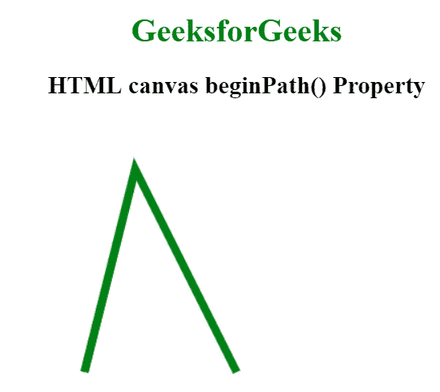
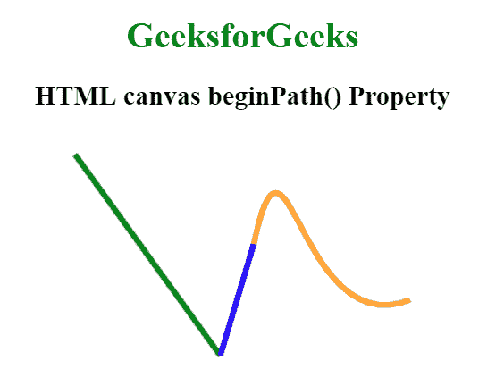

# HTML |画布 beginPath()方法

> 原文:[https://www.geeksforgeeks.org/html-canvas-beginpath-method/](https://www.geeksforgeeks.org/html-canvas-beginpath-method/)

canvas beginPath()方法用于启动路径或重置当前路径。moveTo()、lineTo()、quadricCurveTo()、bezierCurveTo()、arcTo()和 arc()方法用于创建路径。另外，stroke()方法用于在画布上绘制路径。

**语法:**

```html
context.beginPath();
```

**例 1:**

```html
<!DOCTYPE html> 
<html> 

<head> 
    <title> 
        HTML canvas beginPath() Property 
    </title> 
</head> 

<body style="text-align:center;"> 

    <h1 style="color:green;">
        GeeksforGeeks
    </h1> 

    <h2>HTML canvas beginPath() Property</h2> 

    <canvas id="GFG" width="500" height="300"></canvas> 

    <script> 
        var GFG = document.getElementById("GFG"); 
        var context = GFG.getContext("2d");

        // Create a path
        context.beginPath();

        // Set the path width
        context.lineWidth = "8";

        // Set the path color
        context.strokeStyle = "green";

        context.moveTo(100, 250);
        context.lineTo(150, 50);
        context.lineTo(250, 250);

        context.stroke();

        context.beginPath();
    </script> 
</body> 

</html>                    
```

**输出:**


**例 2:**

```html
<!DOCTYPE html> 
<html> 

<head> 
    <title> 
        HTML canvas beginPath() Property 
    </title> 
</head> 

<body style="text-align:center;"> 

    <h1 style="color:green;">
        GeeksforGeeks
    </h1> 

    <h2>HTML canvas beginPath() Property</h2> 

    <canvas id="GFG" width="500" height="300"></canvas> 

    <script> 
        var GFG = document.getElementById("GFG"); 
        var context = GFG.getContext("2d");

        // Set the path width
        context.lineWidth = 5;

        // Create path
        context.beginPath();
        context.moveTo(100, 20);
        context.lineTo(230, 200);

        // Set path color
        context.strokeStyle = 'green';  
        context.stroke();

        // Create another path
        context.beginPath();
        context.moveTo(230, 200);  
        context.quadraticCurveTo(230, 200, 260, 100);

        // Set path color
        context.strokeStyle = 'blue';  
        context.stroke();  

        // Create another path
        context.beginPath();
        context.moveTo(260, 100);    
        context.bezierCurveTo(290, -40, 300, 190, 400, 150);

        // Set path color
        context.strokeStyle = 'orange';    
        context.stroke();
        context.closePath();  
   </script>  
</body> 

</html> 
```



**支持的浏览器:**HTML 画布 beginPath()方法支持的浏览器如下:

*   谷歌 Chrome
*   Internet Explorer 9.0
*   火狐浏览器
*   旅行队
*   歌剧