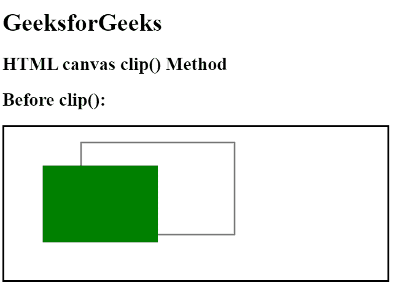
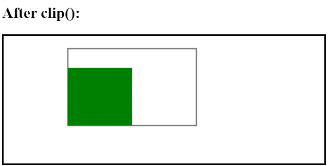

# HTML |画布剪辑()方法

> 原文:[https://www.geeksforgeeks.org/html-canvas-clip-method/](https://www.geeksforgeeks.org/html-canvas-clip-method/)

**剪辑()**方法用于从给定/原始画布中剪辑任何形状和大小的区域/部分。剪切区域后，进一步的绘图只能应用于剪切的区域。虽然 save()和 restore()方法可以用来回到前面的画布。

**语法:**

```html
context.clip();
```

**示例:**

```html
<!DOCTYPE html>
<html>

<head>
    <title>
        HTML canvas clip() Method
    </title>
</head>

<body style="text-align:left;">

    <h1>GeeksforGeeks</h1>

    <h2>HTML canvas clip() Method</h2>
    <h2>Before clip():</h2>
    <canvas id="GFG" width="500" height="200" style="border:2px solid">
    </canvas>

    <script>
        var doc_id = document.getElementById("GFG");
        var context = doc_id.getContext("2d");

        // Draw a rectangle
        context.rect(100, 20, 200, 120);
        context.stroke();

        // Draw green rectangle
        context.fillStyle = "green";
        context.fillRect(50, 50, 150, 100);
    </script>
    <h2>After clip():</h2>
    <canvas id="GFG2" width="500" height="200" style="border:2px solid ;">
    </canvas>

    <script>
        var doc_id = document.getElementById("GFG2");
        var context = doc_id.getContext("2d");
        // Clip a region
        context.rect(100, 20, 200, 120);
        context.stroke();
        context.clip();

        // Draw green rectangle after clip()
        context.fillStyle = "green";
        context.fillRect(50, 50, 150, 100);
    </script>
</body>

</html>
```

**输出:**




**支持的浏览器:****HTML 画布剪辑()方法**支持的浏览器如下:

*   谷歌 Chrome
*   Internet Explorer 9.0
*   火狐浏览器
*   旅行队
*   歌剧