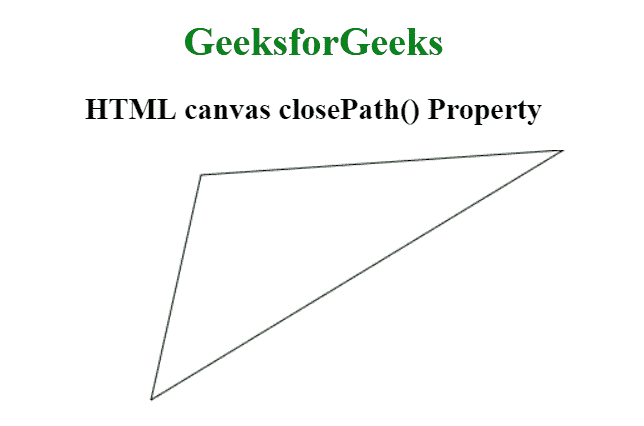
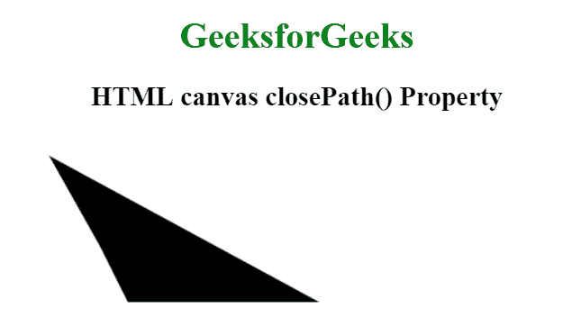

# HTML |画布 closePath()方法

> 原文:[https://www.geeksforgeeks.org/html-canvas-closepath-method/](https://www.geeksforgeeks.org/html-canvas-closepath-method/)

canvas beginPath()方法用于创建从当前点到起点的路径。调用 closePath()方法后，我们可以使用 stroke()方法绘制路径，fill()方法以黑色作为默认填充路径，fillStyle 属性以另一种颜色或渐变或图案进行填充。

**语法:**

```html
context.closePath();
```

**示例 1:** 本示例不使用 fill()方法填充闭合路径。

```html
<!DOCTYPE html>
<html>

<head> 
    <title> 
        HTML canvas closePath() Property 
    </title> 
</head> 

<body style="text-align:center;"> 

    <h1 style="color:green">
        GeeksforGeeks
    </h1> 

    <h2>HTML canvas closePath() Property</h2> 

    <canvas id="GFG" width="500" height="300">
    </canvas> 

    <script>
        var id_cont = document.getElementById("GFG");
        var context = id_cont.getContext("2d");
        context.beginPath();
        context.moveTo(450, 0);
        context.lineTo(120, 200);
        context.lineTo(160, 20);
        context.closePath();
        context.stroke();
    </script>
</body> 

</html>    
```

**输出:**


**示例 2:** 本示例使用 fill()方法填充闭合路径。

```html
<!DOCTYPE html>
<html>

<head> 
    <title> 
        HTML canvas closePath() Property 
    </title> 
</head> 

<body style="text-align:center;"> 

    <h1 style="color:green">
        GeeksforGeeks
    </h1> 

    <h2>HTML canvas closePath() Property</h2> 

    <canvas id="GFG" width="500" height="300">
    </canvas> 

    <script>
        var id_cont = document.getElementById("GFG");
        var context = id_cont.getContext("2d");
        context.beginPath();
        context.moveTo(30, 20);
        context.lineTo(75, 100);
        context.lineTo(100, 150);
        context.lineTo(270, 150);
        context.closePath();
        context.fill();
    </script>
</body> 

</html>
```

**输出:**


**支持的浏览器:**canvas beginPath()方法支持的浏览器如下:

*   谷歌 Chrome
*   Internet Explorer 9.0
*   火狐浏览器
*   歌剧
*   旅行队