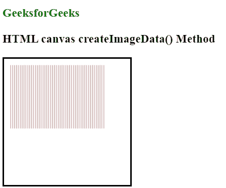

# HTML |画布 createImageData()方法

> 原文:[https://www . geesforgeks . org/html-canvas-createimagedata-method/](https://www.geeksforgeeks.org/html-canvas-createimagedata-method/)

**createImageData()方法**用于创建一个新的空白 ImageData 对象。默认情况下，新对象的像素为透明黑色。

createImageData()方法有两种语法:

*   它用于创建具有指定尺寸(以像素为单位)的新 ImageData 对象:
    **语法:**

    ```html
    var imgData = context.createImageData(width, height);
    ```

*   它用于创建一个新的图像数据对象，其尺寸与另一个图像数据指定的对象相同。它不会复制图像数据。
    **语法:**

```html
var imgData=context.createImageData(imageData);
```

**参数值:**

*   **宽度:**表示新 ImageData 对象的宽度(以像素为单位)。
*   **高度:**表示新 ImageData 对象的高度(以像素为单位)。
*   **图像数据:**是另一个图像数据对象

**示例:**

```html
<!DOCTYPE html>
<html>

<body>
    <h3 style="color:green">GeeksforGeeks</h3>
    <h3>HTML canvas createImageData() Method</h3>
    <canvas id="myCanvas"
            width="200"
            height="200"
            style="border:2px solid ;">
  </canvas>
    <p id=g eeks></p>
    <script>
        var can = document.getElementById("myCanvas");
        var gfg = can.getContext("2d");
        var imgData = gfg.createImageData(150, 100);

        var i;
        for (i = 0; i < imgData.data.length; i += 3) {
            imgData.data[i + 0] = 100;
            imgData.data[i + 1] = 0;
            imgData.data[i + 2] = 0;
        }

        gfg.putImageData(imgData, 10, 10);
    </script>

</body>

</html>
```

**输出:**


**支持的浏览器:**

*   铬
*   Mozilla Firefox
*   Internet Explorer 9.0
*   歌剧
*   旅行队