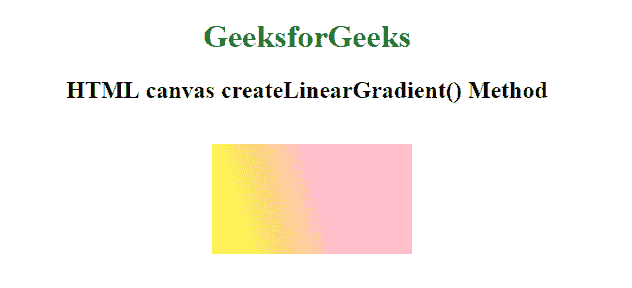
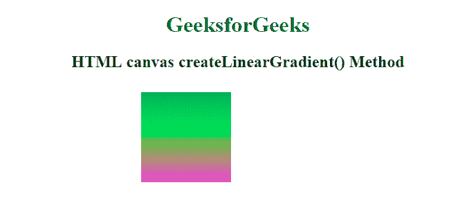

# HTML |画布 createLinearGradient()方法

> 原文:[https://www . geeksforgeeks . org/html-canvas-createrlinegradient-method/](https://www.geeksforgeeks.org/html-canvas-createlineargradient-method/)

使用 **HTML 画布创建线性渐变()**方法创建线性渐变对象。
渐变可用于填充矩形、圆形、线条、文本等不同颜色。然后，我们可以将渐变颜色分配给 **strokeStyle** 或 **fillStyle** 属性，以填充或绘制矩形、圆形、直线、文本等形状。
方法**添加颜色停止()**方法添加不同的颜色，并在渐变对象中定位颜色。

**语法:**:

```html
context.createLinearGradient(x0, y0, x1, y1);
```

**参数:**:

1.  **x0:** 此参数表示渐变起点的 x 坐标。
2.  **y0:** 此参数表示渐变起点的 y 坐标。
3.  **x1:** 该参数表示渐变终点的 x 坐标。
4.  **y1:** 该参数表示渐变终点的 y 坐标。

**例 1** :

```html
<!DOCTYPE html>
<html>

<head>
    <title>
      HTML canvas 
      createLinearGradient() Method
  </title>
</head>

<body>
    <center>
        <h1 style="color:green">
          GeeksforGeeks
      </h1>
        <h2>
          HTML canvas 
          createLinearGradient() Method
      </h2>
        <canvas id="myCanvas" 
                width="350"
                height="180">
        </canvas>
        <script>
            var a = document.getElementById(
              "myCanvas");
            var gctx = a.getContext("2d");
            var clg =
                gctx.createLinearGradient(
                  100, 150, 200, 120);

            clg.addColorStop(0, "yellow");
            clg.addColorStop(1, "pink");
            gctx.fillStyle = clg;
            gctx.fillRect(80, 20, 200, 110);
        </script>
    </center>
</body>

</html>
```

**输出:**


**例 2:**

```html
<!DOCTYPE HTML>

<html>

<head>
    <title>
        HTML canvas createLinearGradient() Method
    </title>
</head>

<body>
    <center>
        <h1 style="color:green">
          GeeksforGeeks
      </h1>
        <h2>
          HTML canvas 
          createLinearGradient() Method
      </h2>
        <canvas id="mycanvas"></canvas>
        <script>
            var canvas = document.getElementById('mycanvas');

            var ctx = canvas.getContext('2d');

            var lingrad = ctx.createLinearGradient(0, 0, 0, 150);

            lingrad.addColorStop(0, '#00AB3B');
            lingrad.addColorStop(0.5, '#45ec3f');

            lingrad.addColorStop(0.5, '#66CC20');
            lingrad.addColorStop(1, '#f3f');

            ctx.fillStyle = lingrad;

            // draw shape
            ctx.fillRect(10, 10, 130, 130);
        </script>
    </center>
</body>

</html>
```

**输出:**


**支持的浏览器:****画布 createLinearGradient()方法**支持的浏览器如下:

*   谷歌 Chrome
*   Internet Explorer 9.0
*   火狐浏览器
*   苹果 Safari
*   歌剧