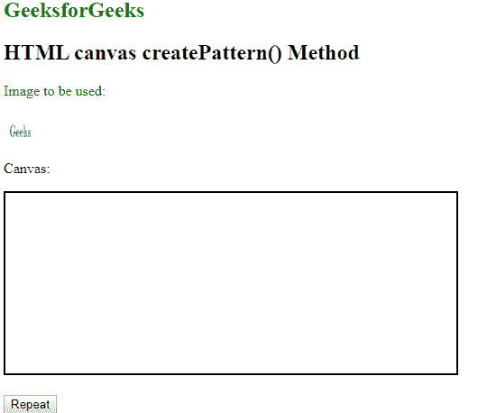
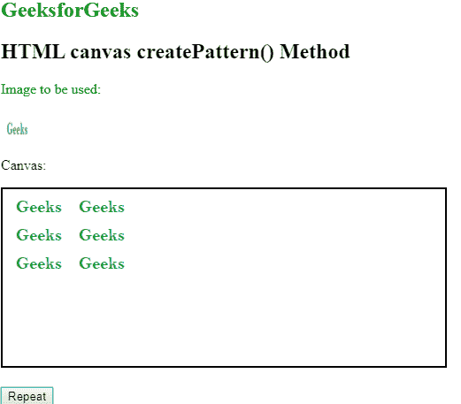

# HTML |画布 createPattern()方法

> 原文:[https://www . geesforgeks . org/html-canvas-create pattern-method/](https://www.geeksforgeeks.org/html-canvas-createpattern-method/)

**createPattern()方法**用于在指定方向上重复指定的元素。它可以是图像、视频或任何其他画布元素。

**语法:**

```html
context.createPattern(image, "repeat | repeat-x | repeat-y | no-repeat");
```

**参数:**

*   **图像:**它指定要使用的图案的图像、画布或视频元素。
*   **重复:**它水平和垂直重复该模式。这是默认设置。
*   **重复-x:** 它只水平重复模式。
*   **repeat-y:** 它只垂直重复模式。
*   **不重复:**不重复模式。

**示例:**

```html
<!DOCTYPE html>
<html>

<head>
    <title>
        HTML | canvas createPattern() Method
    </title>
</head>
<body>
    <h2 style="color:green;"> GeeksforGeeks </h2>
    <h2> HTML canvas createPattern() Method </h2>
    <p style="color:green;">Image to be used:</p>

    

    <p>Canvas:</p>
    <canvas id="myCanvas" width="500" height="200" 
            style="border:2px solid ">
    </canvas>
    <br><br>

    <!-- Change the values here -->
    <button onclick="create('repeat')">Repeat</button>

    <!-- Script to repeat the pattern -->
    <script>
        function create(value) {
            var gfg = document.getElementById("myCanvas");
            var context = gfg.getContext("2d");
            context.clearRect(0, 0, gfg.width, gfg.height);
            var img = document.getElementById("geeks")
            var pattern = context.createPattern(img, value);
            context.rect(0, 0, 150, 100);
            context.fillStyle = pattern;
            context.fill();
        }
    </script>
</body>

</html>
```

**输出:**

*   **点击按钮前:**
    
*   **点击重复按钮后:**
    

**支持的浏览器:**HTML 画布 createPattern()方法支持的浏览器如下:

*   铬
*   Mozilla Firefox
*   Internet Explorer 9.0
*   歌剧
*   旅行队