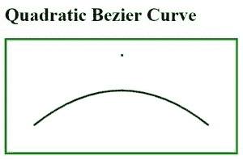
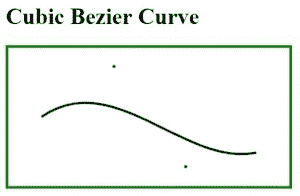
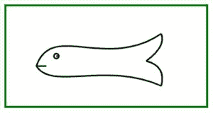

# HTML |画布绘制贝塞尔曲线

> 原文:[https://www . geesforgeks . org/html-canvas-draw-bezier-curve/](https://www.geeksforgeeks.org/html-canvas-draw-bezier-curve/)

HTML 画布上的曲线可以使用圆弧绘制，但是使用圆弧绘制复杂的图表是一项相当繁琐的任务。在给定的情况下，贝塞尔曲线在提供更多绘制曲线的灵活性方面非常有用。HTML 画布上的贝塞尔曲线是使用一个起点、一个或多个控制点和一个端点绘制的。**示例:**在绘制风景、现实世界对象、不规则形状等的情况下。
贝塞尔曲线可以通过两种方式绘制:

*   二次贝塞尔曲线
*   三次贝塞尔曲线

**二次贝塞尔曲线:**该曲线由*一*控制点控制。

**语法:**

```html
moveTo(start_pnt_X, start_pnt_Y);
context.quadraticCurveTo(cntrl_pnt_X, cntrl_pnt_Y, end_pnt_X, end_pnt_y);

```

**示例:**本示例使用二次贝塞尔曲线创建曲线。

```html
<!DOCTYPE html> 
<html>

<head>
    <title>
        Quadratic Bezier Curve
    </title>
</head>

<body> 
    <h1>Quadratic Bezier Curve</h1>

    <canvas id="CanvasOfGeeks" width="400" height="200" 
            style="border:solid 4px green"> 

    <script> 
        var c = document.getElementById("CanvasOfGeeks");
        var context = c.getContext("2d");

        var start_pnt_X = 50;
        var start_pnt_Y = 150;
        var cntrl_pnt_X = 200;
        var cntrl_pnt_Y = 30;
        var end_pnt_X = 350;
        var end_pnt_Y = 150;

        /* Start new path */
        context.beginPath();
        context.lineWidth=3; 
        context.strokeText( ".", cntrl_pnt_X, cntrl_pnt_Y);

        /* Starting point of the curve */
        context.moveTo(start_pnt_X, start_pnt_Y); 

        context.quadraticCurveTo(cntrl_pnt_X, 
                    cntrl_pnt_Y, end_pnt_X, end_pnt_Y);

        /* drawing line on the canvas */
        context.stroke();
    </script> 
</body> 

</html>                    
```

**输出:**


**说明:**

*   [先决条件:HTML 画布基础知识](https://www.geeksforgeeks.org/html-canvas-basics/)
*   **第一行:**画布对象的引用使用 DOM 概念存储在变量‘c’中。
    **第二条线:**没有画布的画境，什么都画不出来。

    ```html
    var c = document.getElementById("CanvasOfGeeks"); 
           var context = c.getContext("2d");

    ```

*   可以通过覆盖上下文对象的“线宽”属性值来改变线宽。

    ```html
    context.lineWidth=3;
    ```

*   用于在控制点的坐标上放置一个点。你可以看到上图中的点。

    ```html
    context.strokeText( ".", cntrl_pnt_X, cntrl_pnt_Y);
    ```

*   此函数用于从函数中提到的起点绘制曲线。

    ```html
    context.quadraticCurveTo(cntrl_pnt_X, cntrl_pnt_Y, end_pnt_X, end_pnt_Y);
    ```

*   该函数用于移动上下文。

    ```html
    context.moveTo(start_pnt_X, start_pnt_Y);
    ```

**注意:**请将控制点保持在画布边界内。

**三次贝塞尔曲线:**该曲线由*两个*控制点控制。

**语法:**

```html
moveTo(start_pnt_X, start_pnt_Y);
contex.bezierCurveTo(cntrl_pnt_1_X, cntrl_pnt_1_Y, cntrl_pnt_2_X,
                      cntrl_pnt_2_Y, end_pnt_X, end_pnt_y);

```

**示例:**本示例使用三次贝塞尔曲线创建曲线。

```html
<!DOCTYPE html> 
<html>

<head>
    <title>
        Cubic Bezier Curve
    </title>
</head>

<body> 
    <h1>Cubic Bezier Curve</h1>

    <canvas id="CanvasOfGeeks" width="400" height="200" 
            style="border:solid 4px green"> 

    <script> 
        var c = document.getElementById("CanvasOfGeeks"); 
        var context = c.getContext("2d");

        var start_pnt_X = 50;
        var start_pnt_Y = 100;
        var cntrl_pnt_1_X = 150;
        var cntrl_pnt_1_Y = 30;
        var cntrl_pnt_2_X = 250;
        var cntrl_pnt_2_Y = 170;
        var end_pnt_X     = 350;
        var end_pnt_Y     = 150;

        /* Start a new Path */
        context.beginPath();     
        context.lineWidth=3;

        /* Representing first control point */
        context.strokeText( ".", cntrl_pnt_1_X, cntrl_pnt_1_Y); 

        /* Representing second control point */
        context.strokeText( ".", cntrl_pnt_2_X, cntrl_pnt_2_Y); 

        /* Starting point of the curve */
        context.moveTo(start_pnt_X, start_pnt_Y); 
        context.bezierCurveTo(cntrl_pnt_1_X, cntrl_pnt_1_Y, 
            cntrl_pnt_2_X, cntrl_pnt_2_Y, end_pnt_X, end_pnt_Y);

        /* Drawing line on the canvas  */
        context.stroke(); 
    </script> 
</body> 

</html>                    
```

**输出:**


**示例:**本示例使用贝塞尔曲线绘制一条鱼。
T3】输入:

```html
<!DOCTYPE html>
<html> 

<head>
    <title>
        Drawing a fish using Bezier Curve
    </title>
</head>

<body> 
    <canvas id="CanvasOfGeeks" width="400" height="200" 
            style="border:solid 4px green"> 

    <script> 
        var c = document.getElementById("CanvasOfGeeks"); 
        var context = c.getContext("2d");

        /* Start a new Path */
        context.beginPath();
        context.lineWidth=3;

        /* Upper curve of the fish, from mouth to tail */
        context.moveTo(60, 120);
        context.bezierCurveTo(90, 30, 200, 130, 310, 55);

        /* Lower curve of the fish, from mouth to tail */
        context.moveTo(60, 120);
        context.bezierCurveTo(90, 170, 200, 110, 310, 160);

        /* Upper half of tail */
        context.moveTo(310, 55);
        context.quadraticCurveTo(320, 80, 280, 110);

        /* lower half of tail */
        context.moveTo(310, 160);
        context.quadraticCurveTo(320, 120, 280, 110);

        /* Eye of the fish */
        context.moveTo(100, 100);
        context.arc(100, 100, 5, 0, 2*Math.PI);

        /* Mouth of the fish */
        context.moveTo(60, 120);
        context.lineTo(80, 120);
        context.stroke();
    </script> 
</body> 

</html>                    
```

**输出:**
