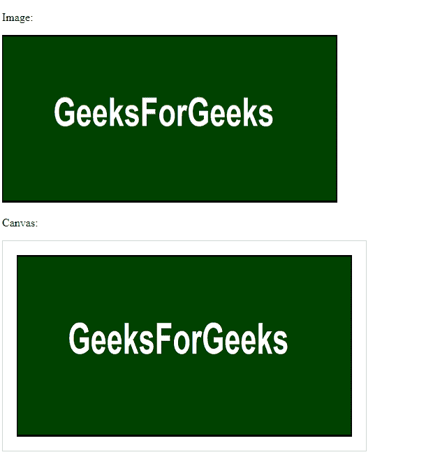

# HTML |画布 drawImage()方法

> 原文:[https://www.geeksforgeeks.org/html-canvas-drawimage-method/](https://www.geeksforgeeks.org/html-canvas-drawimage-method/)

在 [HTML5](https://www.geeksforgeeks.org/html5-introduction/) 中，画布**drawing image()**功能用于在画布上显示图像或视频。该功能可用于显示整个图像或图像的一小部分。但是，必须先加载图像，才能将其进一步加载到画布上。

**语法:**

```html
context.drawImage(img, x, y, swidth, sheight, sx, sy, width, height);
```

**参数值:**

*   **img:** 表示要在画布上绘制的图像或视频。
*   **x:** 表示图像必须放置的 x 坐标。
*   **y:** 表示需要放置图像的 y 坐标。
*   **switch:**为可选参数，表示裁剪图像的宽度。
*   **高度:**为可选参数，表示裁剪图像的高度。
*   **sx:** 为可选参数，表示开始剪裁的 x 坐标。
*   **sy:** 可选参数，表示 y 坐标从哪里开始裁剪。
*   **宽度:**为可选参数，表示要使用的图像宽度。
*   **高度:**为可选参数，表示要使用的图像高度。

**示例:**

## 超文本标记语言

```html
<!DOCTYPE html>
<html>

<head>
    <title>
        HTML | canvas drawImage() Method
    </title>
</head>

<body>

<p>Image:</p>

    

<p>Canvas:</p>

    <canvas id="myGFGCanvas" width="520" height="300"
            style="border: 1px solid #d3d3d3;">
        Your browser is not supported
        for HTML5 canvas tag.
    </canvas>

    <script>
        window.onload = function () {
            var c = document.getElementById("myGFGCanvas");
            var ctx = c.getContext("2d");
            var img = document.getElementById("GFG");
            ctx.drawImage(img, 20, 20);
        };
    </script>
</body>

</html>
```

**输出:**

