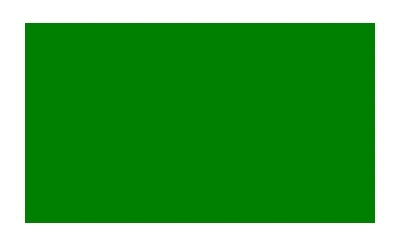

# HTML |画布填充()方法

> 原文:[https://www.geeksforgeeks.org/html-canvas-fill-method/](https://www.geeksforgeeks.org/html-canvas-fill-method/)

**画布填充()**方法用于*填充当前绘制路径*。**画布填充()**方法的默认颜色是黑色。
**语法:**

```html
context.fill()
```

**示例-1:**

## 超文本标记语言

```html
<!DOCTYPE html>
<html>

<head>
    <title>
        HTML canvas fill() Method
    </title>
</head>

<body>
    <canvas id="GFG"
            width="500"
            height="300">
  </canvas>

    <script>
        var x =
            document.getElementById("GFG");
        var contex =
            x.getContext("2d");
        contex.rect(50, 50, 350, 200);
        contex.fill();
        contex.stroke();
    </script>

</body>

</html>
```

**输出:**


**示例-2:**

## 超文本标记语言

```html
<!DOCTYPE html>
<html>

<head>
    <title>
        HTML canvas fill() Method
    </title>
</head>

<body>
    <canvas id="GFG"
            width="500"
            height="300">
  </canvas>

    <script>
        var x =
            document.getElementById("GFG");
        var contex =
            x.getContext("2d");
        contex.rect(50, 50, 350, 200);
        contex.fillStyle = "green";
        contex.fill();
        contex.stroke();
    </script>

</body>

</html>
```

**输出:**



**支持的浏览器:**

*   谷歌 Chrome
*   Internet Explorer 9.0
*   火狐浏览器
*   旅行队
*   歌剧