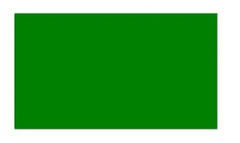

# HTML |画布 fillRect()方法

> 原文:[https://www.geeksforgeeks.org/html-canvas-fillrect-method/](https://www.geeksforgeeks.org/html-canvas-fillrect-method/)

**填充矩形()方法**用于使用给定的颜色填充矩形。fillRect()方法的默认颜色是黑色。

**语法:**

```html
context.fillRect( x, y, width, height )
```

**参数:**该方法接受上述和下述四个参数:

*   **x:** 存储矩形左上角的 x 坐标。
*   **y:** 存储矩形左上角的 y 坐标。
*   **宽度:**以像素为单位存储宽度。
*   **高度:**以像素为单位存储高度。

**示例 1:** 本示例使用 fillRect()方法创建矩形并填充默认颜色(黑色)。

```html
<!DOCTYPE html>
<html>
<head>
    <title>
        HTML canvas fillRect() Method
    </title>
</head>
<body>
    <canvas id="GFG" width="500" height="300"></canvas>

    <script>
        var x = document.getElementById("GFG");
        var contex = x.getContext("2d");
        contex.fillRect(50, 50, 350, 200);
        contex.stroke();
    </script> 

</body>
</html>
```

**输出:**


**示例 2:** 本示例使用 fillRect()方法创建矩形，并用 ve 颜色(绿色)填充。

```html
<!DOCTYPE html>
<html>
<head>
    <title>
        HTML canvas fillRect() Method
    </title>
</head>
<body>
    <canvas id="GFG" width="500" height="300"></canvas>

    <script>
        var x = document.getElementById("GFG");
        var contex = x.getContext("2d");
        contex.fillStyle = "green";
        contex.fillRect(50, 50, 350, 200);
        contex.stroke();
    </script> 

</body>
</html>
```

**输出:**


**支持的浏览器:**fillect()方法支持的浏览器如下:

*   谷歌 Chrome
*   Internet Explorer 9.0
*   火狐浏览器
*   旅行队
*   歌剧