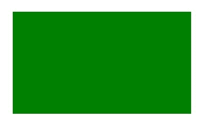
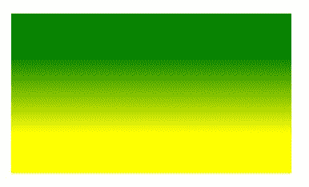

# HTML |画布填充样式属性

> 原文:[https://www . geesforgeks . org/html-canvas-fill style-property/](https://www.geeksforgeeks.org/html-canvas-fillstyle-property/)

**画布填充样式属性**用于**设置**或**返回** *用于填充绘图的颜色、渐变或图案*。

**风格:**

```html
context.fillStyle=color|gradient|pattern;
```

**属性值:**

*   **颜色:**用于设置绘图的填充颜色。画布填充样式属性的默认值是黑色。
*   **渐变:**用于设置渐变对象填充图形。渐变对象是线性或径向的。
*   **图案:**用于设置填充图纸的图案。

**示例-1:**

```html
<!DOCTYPE html>
<html>

<head>
    <title>
        HTML canvas fillStyle property
    </title>
</head>

<body>
    <canvas id="GFG" 
            width="500" 
            height="300">
  </canvas>

    <script>
        var x = document.getElementById("GFG");
        var contex = x.getContext("2d");

        // set fillStyle color green.
        contex.fillStyle = "green";
        contex.fillRect(50, 50, 350, 200);
        contex.stroke();
    </script>

</body>

</html>
```

**输出:**


**示例-2:**

```html
<!DOCTYPE html>
<html>

<head>
    <title>
        HTML canvas fillStyle property
    </title>
</head>

<body>
    <canvas id="GFG" 
            width="500"
            height="300">
  </canvas>

    <script>
        var x = 
            document.getElementById("GFG");
        var contex = 
            x.getContext("2d");
        var gr = 
            contex.createLinearGradient(50, 0, 350, 0);
        gr.addColorStop(0, "green");
        gr.addColorStop(1, "white");
        contex.fillStyle = gr;
        contex.fillRect(50, 50, 350, 200);
        contex.stroke();
    </script>
</body>

</html>
```

**输出:**


**示例-3:**

```html
<!DOCTYPE html>
<html>

<head>
    <title>
        HTML canvas fillStyle property
    </title>
</head>

<body>
    <canvas id="GFG"
            width="500"
            height="300">
  </canvas>

    <script>
        var x = 
            document.getElementById("GFG");

        var contex =
            x.getContext("2d");

        var gr =
            contex.createLinearGradient(0, 100, 0, 200);
        gr.addColorStop(0, "green");
        gr.addColorStop(1, "yellow");
        contex.fillStyle = gr;
        contex.fillRect(50, 50, 350, 200);
        contex.stroke();
    </script>
</body>

</html>
```

**输出:**


**支持的浏览器:**

*   谷歌 Chrome
*   Internet Explorer 9.0
*   火狐浏览器
*   旅行队
*   歌剧