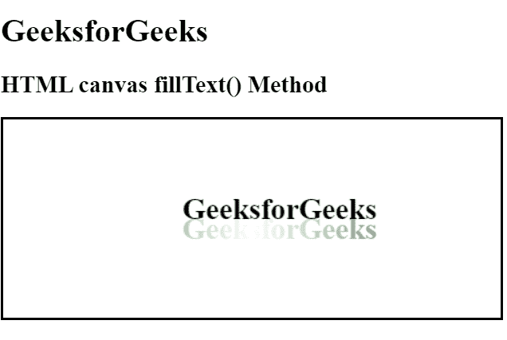

# HTML |画布 fillText()方法

> 原文:[https://www.geeksforgeeks.org/html-canvas-filltext-method/](https://www.geeksforgeeks.org/html-canvas-filltext-method/)

**fillText()方法**用于在画布上绘制填充文本。文本的默认颜色是黑色。

**语法:**

```html
context.fillText(text, x, y, maxWidth);
```

**参数:**

*   **文本:**此参数指定要写在画布上的文本。
*   **x:** 此参数指定从何处开始文本的 x 坐标。
*   **y:** 此参数指定文本结束的 y 坐标。
*   **最大宽度:**此参数指定文本允许的最大宽度。它是可选的。

**例 1:**

```html
<!DOCTYPE html>
<html>

<head>
    <title>
        HTML canvas fillText() Method
    </title>
</head>

<body style="text-align:left;">

    <h1>GeeksforGeeks</h1>

    <h2>HTML canvas fillText() Method</h2>

    <canvas id="GFG" width="500" height="200" style="border:2px solid">
    </canvas>

    <script>
        var doc_id = document.getElementById("GFG");
        var context = doc_id.getContext("2d");
        context.font = "bold 30px solid";
        context.fillText("GeeksforGeeks", 180, 100);

        // Create gradient
        var grad = context.createLinearGradient(0, 0, doc_id.width, 0);
        grad.addColorStop("0", "green");
        grad.addColorStop("0.5", "white");
        grad.addColorStop("1.0", "green");
        // Fill with gradient
        context.fillStyle = grad;
        context.fillText("GeeksforGeeks", 180, 120);
    </script>
</body>

</html>
```

**输出:**


**支持的浏览器:**下面列出了 **HTML 画布 fillText()方法**支持的浏览器:

*   谷歌 Chrome
*   Internet Explorer 9.0
*   火狐浏览器
*   旅行队
*   歌剧