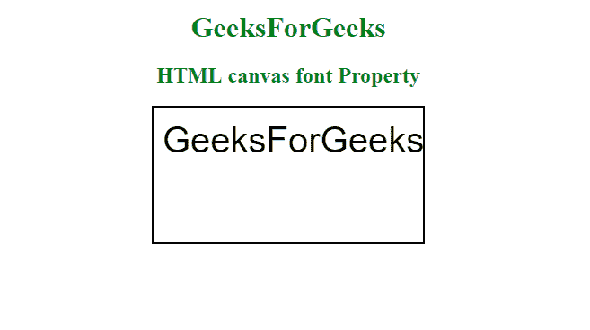

# HTML |画布字体属性

> 原文:[https://www.geeksforgeeks.org/html-canvas-font-property/](https://www.geeksforgeeks.org/html-canvas-font-property/)

**HTML 画布字体属性**用于*更改 **[<画布>](https://www.geeksforgeeks.org/html-canvas-tag/)** 元素*文本内容的当前字体系列。字体属性具有默认属性，即 **10px 无衬线字体**

**语法:**

```html
  context.font="italic small-caps bold 12px arial"; 
```

**属性值:**

*   **字体系列:**用于设置一个 HTML 元素的字体类型。它有几个字体名称作为后备
*   **字体样式:**用于指定 HTML 元素的字体样式。可以是“*正常*、*斜体*或*倾斜*”。
*   **字体粗细:**用于设置字体的粗细。其值可以是“*普通*、*加粗*、*较轻*、*较粗*”。
*   **字体变体:**用于创建小楷效果。可以是“*普通*或者*小盘股*”。
*   **字号:**用于设置 HTML 元素的字号。字体大小可以用不同的方式设置，比如在“*像素*、*百分比*、 *em* 或者我们可以设置像*小*、*大*等数值。
*   **标题:**使用字体标题控件(如*按钮*、*下拉菜单*等)。)
*   **图标:**使用用于标记图标的字体。
*   **菜单:**使用菜单中使用的字体(*下拉菜单*和*菜单列表*)。
*   **消息框:**使用对话框中使用的字体。
*   **小标题:**使用用于标注小控件的字体
*   **状态栏:**使用窗口状态栏中使用的字体。

**示例:**

```html
<!DOCTYPE html>
<html>

<head>
    <title>
      HTML canvas font Property
  </title>
</head>

<body style="text-align:center">

    <h1 style="color:green">
      GeeksForGeeks
  </h1>
    <h2 style="color:green">
      HTML canvas font Property
  </h2>
    <canvas id="sudo" 
            width="300"
            height="150"
            style="border:2px solid">
  </canvas>

    <script>
        var c = document.getElementById("sudo");
        var ctx = c.getContext("2d");
        ctx.font = "40px Arial";
        ctx.fillText("GeeksForGeeks", 10, 50);
    </script>

</body>

</html>
```

**输出:**


**支持的浏览器:****HTML 画布字体属性**支持的浏览器如下:

*   谷歌 Chrome
*   Internet Explorer 9.0
*   火狐浏览器
*   苹果 Safari
*   歌剧