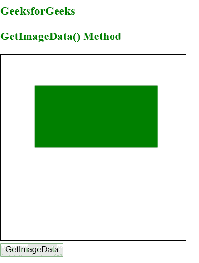
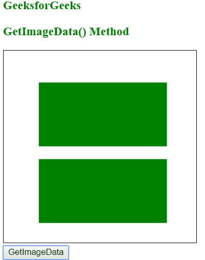

# HTML |画布 getImageData()方法

> 原文:[https://www . geesforgeks . org/html-canvas-getimagedata-method/](https://www.geeksforgeeks.org/html-canvas-getimagedata-method/)

**getImageData()方法**用于在画布上复制指定矩形的像素数据。
图像数据对象中每个像素有 4 条信息，即 RGBA 值:

*   r 表示红色。范围从 0 到 255。
*   g 表示绿色。范围从 0 到 255。
*   b 表示蓝色。范围从 0 到 255。
*   a 表示阿尔法通道。它的范围也从 0 到 255，即 0 是透明的，255 是完全可见的

**语法:**

```html
context.getImageData(x, y, width, height);
```

**参数值:**

*   x:用于指定开始复制的左上角的 x 坐标(以像素为单位)。
*   y:用于指定开始复制的左上角的 x 坐标(以像素为单位)。
*   宽度:是要复制的矩形区域的宽度。
*   高度:是要复制的矩形区域的高度。

**例:**

## 超文本标记语言

```html
<!DOCTYPE html>
<html>

<body>

    <h3 style="color:green; "> GeeksforGeeks</h3>
    <h3 style="color:green; "> GetImageData() Method</h3>
    <canvas id="gfgCanvas"
            width="300"
            height="300"
            style="border:1px solid ;">
    </canvas>

    <script>
        var gfg = document.getElementById("gfgCanvas");
        var context = gfg.getContext("2d");
        context.fillStyle = "green";
        context.fillRect(55, 50, 200, 100);

        function putImage() {
            // getImageData is used to copy the pixels
            var imageData = context.getImageData(55, 50, 200, 100);
            context.putImageData(imageData, 55, 170);
        }
    </script>
    <br>
    <button onclick="putImage()">GetImageData</button>

</body>

</html>
```

**输出:**
**点击前:**



**点击后:**



**支持的浏览器:**

*   铬
*   Mozilla Firefox
*   Internet Explorer 9.0
*   歌剧
*   旅行队