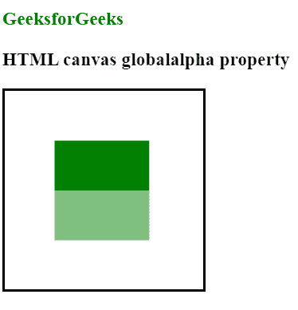

# HTML |画布 globalAlpha 属性

> 原文:[https://www . geesforgeks . org/html-canvas-global alpha-property/](https://www.geeksforgeeks.org/html-canvas-globalalpha-property/)

**全局 Alpha** 属性用于设置或返回图形的当前 Alpha 或透明度值。该值必须是 0.0 到 1.0 之间的数字。
这里，0.0 表示完全透明，1.0 表示不透明。默认情况下是 1.0。

**语法:**

```html
context.globalAlpha=number

```

**属性值:**

*   **数字:**是 0.0 到 1.0 之间的值。

**示例:**

```html
<!DOCTYPE html>
<html>

<body>
    <h3 style="color:green">GeeksforGeeks</h3>
    <h3>HTML canvas globalalpha property</h3>
    <canvas id="myCanvas"
            width="200"
            height="200" 
            style="border:2px solid ;">
  </canvas>

    <script>
        var can = document.getElementById("myCanvas");
        var gfg = can.getContext("2d");
        gfg.fillStyle = "green";
        gfg.fillRect(50, 50, 95, 50);

        //Turn transparency on
        gfg.globalAlpha = 0.5;
        gfg.fillStyle = "green";
        gfg.fillRect(50, 100, 95, 50);
    </script>

</body>

</html>
```

**输出:**


**支持的浏览器:**

*   铬
*   Internet Explorer 9.0
*   旅行队
*   火狐浏览器
*   歌剧